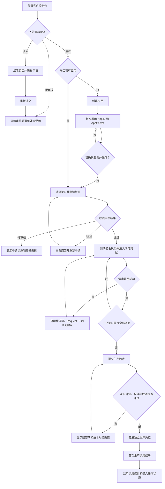
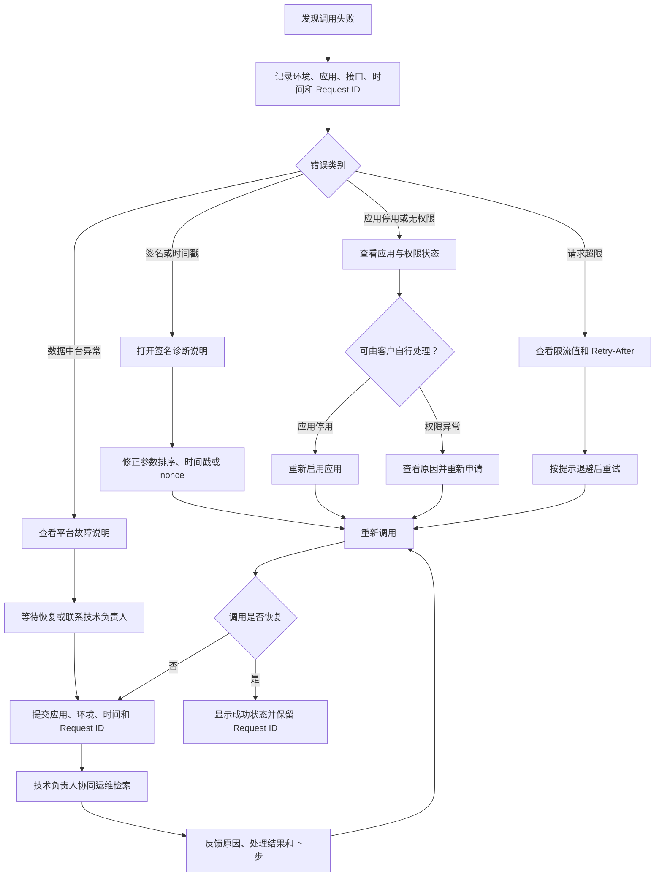
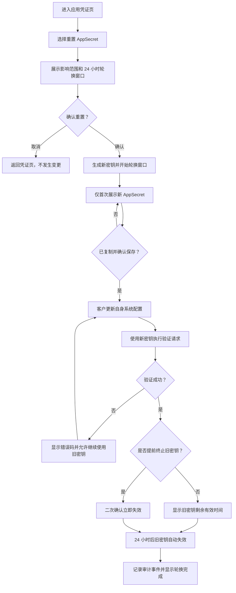

---
stepsCompleted:
  - 1
  - 2
  - 3
  - 4
  - 5
  - 6
  - 7
  - 8
  - 9
  - 10
  - 11
  - 12
  - 13
  - 14
lastStep: 14
inputDocuments:
  - "_agentic-out/planning/prd.md"
  - "_agentic-out/planning/product-brief.md"
  - "_agentic-out/planning/research/product-brief-distillate.md"
  - "_agentic-out/reviews/2026-08-11-prd-validation.md"
uiFoundation: "shadcn/ui"
visualArtifacts:
  - "_agentic-out/planning/ux/color-themes.html"
  - "_agentic-out/planning/ux/design-directions.html"
  - "_agentic-out/reviews/2026-08-12-ux-visual-quality.md"
---

# 轻量化开放平台 UX 设计说明

**作者：** user  
**日期：** 2026-08-12

## 视觉设计契约

本 UX 工作流采用 shadcn/ui 作为可实施的 UI 基础，并通过 Tailwind CSS 语义令牌组织颜色、圆角、间距、排版、层级、焦点和状态样式。

- **设计系统：** 使用 shadcn/ui 组件组合应用界面，不混用第二套组件体系。
- **可访问性基线：** 使用 Radix 交互模式、语义化 HTML、清晰文本标签、可见焦点和完整键盘操作。
- **必备界面状态：** 默认、悬停、激活、禁用、加载、空、错误、成功、选中、危险操作和窄屏适配。
- **必备产物：** UX 设计说明、设计方向预览、组件与状态清单、响应式说明和视觉质量报告。
- **质量标准：** 层级清晰、节奏稳定、密度适合开发者控制台、色彩克制、文字易读，避免装饰性渐变、无意义嵌套卡片和模板化 AI 风格。

## 执行摘要

### 项目愿景

轻量化开放平台为供应链合作企业提供一条清晰、可信、可自助完成的 API 接入路径。体验设计帮助客户开发者从企业注册逐步完成应用创建、权限申请、沙箱联调和生产准入，并在发生问题时通过状态、错误码、Request ID 和操作指引自行恢复。

控制台不是通用 API 管理平台，也不是内部运营后台。设计重点是缩短首次接入周期、降低认知负担、减少反复沟通，并让安全审核、环境隔离和生产门槛对用户透明可理解。

### 目标用户

**主要用户：外部客户开发者**

- 来自现有供应链合作企业，负责将订单和客户资料接入本企业业务系统。
- 熟悉基础 API 调用，但可能不熟悉 HMAC 签名、nonce、防重放、权限审批和我方数据契约。
- 主要使用桌面端 Chrome 或 Edge，在开发、联调、上线和故障排查场景中使用平台。
- 期待快速找到下一步操作、复制准确凭证、理解当前状态并定位调用失败原因。

**协作用户：客户业务联系人**

- 可能参与企业注册、联系人信息维护及内部协调。
- 技术熟练度可能低于开发者，需要清晰表单、状态解释和人工支持渠道。

**外部于一期控制台的内部角色**

- 商务专员负责企业入驻审核。
- 业务产品负责接口权限审批。
- 技术对接负责人负责生产验收和客户问题首接。
- 运维负责深入排查网关、日志和接口故障。
- 这些角色一期没有平台操作界面，但其线下动作会改变客户可见状态，因此控制台必须准确表达审核结果、原因和下一步。

### 关键设计挑战

1. **把跨角色、跨渠道的接入流程呈现为连续体验。** 审核在线下发生，但客户不能感到流程消失。每个阶段显示当前状态、责任环节、阻塞原因、预期动作和支持渠道。
2. **在安全要求与低摩擦接入之间取得平衡。** AppSecret 仅展示一次，沙箱与生产凭证隔离，密钥轮换具有 24 小时窗口。界面既要防止误操作，也要解释安全机制。
3. **降低 API 接入与排错的认知成本。** 对签名、时间戳、nonce、分页、限流、脱敏和错误分类采用渐进披露、上下文示例和可复制内容。
4. **清楚区分沙箱与生产。** 环境、凭证、权限、数据和限流均隔离；环境标识持续可见，危险操作和生产状态不得仅依靠颜色区分。
5. **在轻量 MVP 中保持完整状态覆盖。** 覆盖加载、空、待审核、通过、驳回、停用、过期、限流、下游异常和权限不足状态。

### 设计机会

1. **用接入进度作为首次用户的首要引导。** 首页展示注册审核、创建应用、申请权限、沙箱联调、生产验收五阶段进度。
2. **把错误响应转化为恢复路径。** 对签名失败、时间偏差、权限不足、限流和下游异常展示原因、Request ID、建议动作及对应文档入口。
3. **建立可信的凭证操作体验。** 首次密钥展示提供确认、复制反馈、保存提醒和不可恢复说明；重置时展示轮换状态与提前失效风险。
4. **围绕应用建立上下文工作区。** 应用详情聚合环境凭证、接口权限、调试入口和调用统计。
5. **使用适合开发者工具的高密度、低装饰界面。** 采用稳定侧栏、紧凑表格、等宽代码区域、明确状态徽标和克制色彩。

## 核心用户体验

### 定义性体验

平台的核心体验是“从当前接入状态推进到下一里程碑”。用户登录后首先看到企业入驻、创建应用、申请接口权限、完成沙箱联调、通过生产验收、观察生产调用六阶段中的当前位置。每个阶段只突出一个主要下一步，同时允许用户进入应用工作区处理凭证、权限、文档和调用统计。

最关键的交互是“应用接入工作区”：用户选择应用后，在同一上下文内查看环境状态、凭证、接口权限、调试入口、生产准入条件和调用概况。导航服务于接入任务，而不是让用户自行拼接多个功能模块。

### 平台策略

- 一期采用桌面 Web 控制台，优先适配 Chrome 和 Edge 最新两个主要版本。
- 主要交互方式为鼠标和键盘；注册、登录、应用、密钥、权限、文档、调试和统计流程完整支持键盘。
- 不提供离线功能。接口文档和状态信息反映当前在线授权结果。
- 采用固定侧栏与顶部上下文区：侧栏承载总览、应用、API 文档和支持入口；顶部显示当前企业、应用与环境。
- 窄屏只保证基本可读与关键操作，不作为一期移动端产品设计目标。
- 代码、AppID、Request ID 和示例使用等宽字体及一键复制交互。

### 无负担交互

- 登录后自动判断入驻状态；未通过用户直接进入状态页，不展示不可用功能造成干扰。
- 审核通过但没有应用时，首页直接提供“创建第一个应用”。
- 应用创建后立即展示 AppSecret，并在关闭前要求确认已安全保存。
- 权限申请按接口列表逐项操作，不要求用户理解复杂角色或权限模型。
- 文档根据当前接口和环境提供正确地址、参数、签名示例及可复制请求。
- 页面调试器固定为沙箱，不允许切换到生产。
- 错误结果自动匹配原因、修复建议和相关文档锚点。
- Request ID、AppID、接口路径和代码示例均可一键复制，并提供明确复制反馈。
- 环境、应用和权限上下文在页面间保留，避免重复选择。
- 统计默认展示当前应用最近 7 天，不要求用户先配置筛选条件。

### 关键成功时刻

**首次成功时刻：** 用户在沙箱获得第一个成功响应。界面明确展示调用成功、响应时间、Request ID、返回数据和下一建议动作。

**首次价值时刻：** 三个接口联调完成，生产准入条件全部满足，用户可以发起生产验收。界面从调试工具转变为上线准备清单。

**持续价值时刻：** 用户看到生产调用持续成功，并通过近 7 天统计确认系统间数据互通正常。

以下体验失败会显著破坏信任：关闭 AppSecret 前没有充分警告；混淆沙箱和生产；审核待处理却没有责任环节或支持渠道；错误没有 Request ID 和恢复建议；密钥轮换或应用停用没有说明影响。

### 体验原则

1. **下一步优先于功能入口。** 首屏先回答“现在该做什么”，再提供完整导航。
2. **状态必须可解释。** 每个状态同时说明含义、原因、责任环节和下一动作。
3. **应用是工作上下文。** 凭证、权限、调试和统计围绕同一应用组织。
4. **环境差异持续可见。** 沙箱与生产通过文字、图标、位置和色彩共同区分。
5. **安全操作必须可预判。** 在密钥关闭、重置、提前失效和应用停用前说明不可逆后果。
6. **错误必须导向恢复。** 错误信息包含分类、Request ID、修复建议和相关文档入口。
7. **默认路径服务首次接入。** 一期不为少数高级场景增加主流程复杂度。
8. **信息密度服务扫描效率。** 使用紧凑布局，通过层级、分组和渐进披露避免拥挤。

## 期望的情绪体验

### 主要情绪目标

**掌控感：** 用户随时知道当前接入阶段、已完成事项、等待事项、下一责任人和错误恢复方式。

**信任感：** 用户相信沙箱不会影响生产、凭证得到保护、权限状态与调用结果一致、数据严格隔离，并且平台不会隐藏失败。

**胜任感：** 用户完成签名、调通接口或解决错误后，确认自己能够独立完成接入，而不是依赖内部人员逐步指导。

**效率感：** 控制台减少沟通和等待成本，不在原有对接流程之上增加不必要的表单与审批负担。

### 情绪旅程

| 阶段 | 用户可能的初始感受 | 目标感受 | 设计响应 |
|---|---|---|---|
| 首次访问 | 不确定平台是否复杂 | 清楚、可开始 | 简短价值说明、明确注册入口和流程概览 |
| 提交入驻 | 担心审核没有反馈 | 被告知、可预期 | 状态、提交时间、责任环节、支持渠道 |
| 创建应用 | 对凭证安全谨慎 | 严肃但不焦虑 | 首次展示提醒、复制确认、保存检查 |
| 申请权限 | 不确定为何还需审批 | 理解、可跟踪 | 逐接口理由、申请状态、驳回原因 |
| 沙箱联调 | 对签名规则困惑 | 专注、有能力 | 示例、复制、调试反馈和恢复建议 |
| 生产验收 | 担心遗漏上线条件 | 准备充分 | 清单式门槛、已完成证据、阻塞项 |
| 正常运行 | 希望确认互通稳定 | 安心、有效率 | 简洁统计、环境标识、成功趋势 |
| 调用失败 | 焦虑、怀疑平台 | 问题可定位 | 错误分类、Request ID、建议动作和支持入口 |
| 密钥轮换 | 担心中断生产 | 风险可控 | 24 小时时间线、剩余时间、旧密钥状态 |

### 关键微情绪

- **信心而非困惑：** 一个页面只设置一个主要操作；技术术语首次出现时提供短解释；状态不依赖颜色。
- **信任而非怀疑：** 重要状态显示更新时间；审核和权限结果显示原因；调试器持续显示“仅沙箱，不连接生产”。
- **谨慎而非焦虑：** 危险操作提前说明后果；按钮使用具体动作名称，不使用含糊的“确定”。
- **成就而非庆祝噪音：** 首次调通、权限全部通过和生产验收完成时使用克制成功反馈，并立即引导下一步。
- **支持而非责备：** 错误文案说明发生了什么和如何修复；需要人工支持时列出应提交的信息。

### 设计影响

| 目标情绪 | UX 设计方式 |
|---|---|
| 掌控感 | 接入进度、状态时间、下一步、阻塞原因、轮换倒计时 |
| 信任感 | 持续环境标识、准确状态、脱敏预览、审计提示、明确数据边界 |
| 胜任感 | 可复制示例、上下文帮助、结构化错误、成功后的下一任务 |
| 效率感 | 应用上下文保持、合理默认值、批量信息展示、减少重复输入 |
| 安心感 | 生产操作二次确认、不可逆后果说明、恢复路径和支持渠道 |

### 情绪设计原则

1. 确定性高于惊喜。
2. 解释原因，不只展示状态。
3. 成功反馈必须推动下一步。
4. 危险操作在行动前建立风险认知。
5. 错误体验保护用户的胜任感。
6. 视觉克制强化专业可信。
7. 等待状态也必须提供信息价值。

## UX 模式分析与设计参考

### 参考产品分析

#### 阿里云开放平台

可借鉴控制台、服务目录和 API 文档之间的稳定层级，明确企业、应用与环境等资源上下文，并使用状态标签、配置表格和操作入口承载高密度任务。本平台只有三个首发接口和少量应用，不复制大型云平台的产品树、地域、实例和资源组等复杂抽象；首页围绕首次接入进度组织。

#### 企业微信开发者中心

可借鉴以业务场景解释接口用途、持续展示权限要求和错误码，以及建立企业、应用、接口权限从属关系的方式。本平台进一步缩短文档和操作之间的跳转：权限不足直接说明缺失权限和申请入口，签名、分页、限流和错误恢复集中为可执行示例。

#### GitHub

可借鉴稳定侧栏、明确页面标题、紧凑列表、等宽标识符、复制操作、危险区域、细粒度权限说明和克制的状态反馈。GitHub 面向高频复杂协作，本平台用户使用频率较低，因此需要更强的接入流程引导，并将应用、凭证、权限、调试和统计聚合到单一应用工作区。

### 可迁移的 UX 模式

#### 导航模式

- **稳定侧栏：** 总览、应用、API 文档、支持。进入应用后在内容区使用概览、凭证、接口权限、沙箱调试和调用统计页签。
- **持续上下文条：** 显示企业、当前应用、应用状态、当前环境和最近更新时间。环境通过文字、图标和语义色共同表达。
- **有限面包屑：** 控制台保持两层结构；只在 API 文档中使用多级定位。

#### 交互模式

- **任务型总览：** 首页以接入阶段和下一步为核心，不使用通用指标大屏。
- **应用工作区：** 聚合接入状态、环境、AppID、密钥、权限、调试、生产准入和统计。
- **凭证首次展示：** 说明仅展示一次，默认遮挡，主动显示后复制，关闭前确认保存；关闭后仅显示尾号、创建时间和状态。
- **逐接口权限：** 每行显示接口名称、用途、数据范围、状态、申请时间、驳回原因和主要操作。
- **结构化错误恢复：** 固定展示错误名称、原因、建议动作、Request ID、相关文档和支持信息。
- **危险区域：** 密钥提前失效和应用停用放在页面底部独立区域。

### 视觉模式

- 使用中性灰白背景、低饱和边框和单一品牌主色。
- 成功、警告、错误、沙箱和生产使用稳定语义令牌。
- 页面以表格、分段区块和代码区域为主，避免连续嵌套卡片。
- 正文使用无衬线字体；代码、AppID、Request ID、时间戳和路径使用等宽字体。
- 状态徽标由图标、文字和颜色共同表达。
- 关键数字仅在统计页面突出，不把普通字段全部做成指标卡。

### 应避免的反模式

1. 复制大型云平台的多级产品导航。
2. 控制台首页堆满统计卡片，忽略首次接入下一步。
3. 文档与操作割裂，错误和权限状态无法直达相关说明。
4. 对三个接口使用难以理解的通用权限树。
5. 所有内容都使用嵌套卡片。
6. 凭证复制后只给短暂 Toast，不保留安全保存提醒。
7. 把审核等待设计为空白状态。
8. 让用户自行把技术错误码翻译为恢复动作。

### 设计参考策略

**直接采用：** GitHub 式稳定侧栏、高密度列表、等宽标识符、危险区域和凭证安全提示；企业微信开发者中心式场景说明、权限前置条件和错误关联；阿里云式企业—应用—环境上下文。

**简化后采用：** 将云资源控制台缩减为单一应用工作区，将文档限制为三个接口与公共指南，将复杂权限模型缩减为逐接口状态，将仪表盘缩减为接入进度与近 7 天调用概况。

**明确避免：** 多级产品树、营销式首页、装饰渐变、过深设置层级、文档与操作间的多次跳转，以及缺少上下文的状态码和安全警告。

## 设计系统基础

### 设计系统选择

采用 shadcn/ui 作为客户 Web 控制台的基础组件体系，使用 Tailwind CSS 语义变量管理视觉令牌，并遵循 Radix 组件的键盘操作、焦点管理和浮层行为。组件源码归项目所有，不混用 Ant Design、MUI 或其他完整组件体系。

### 选择依据

- 三个月周期需要成熟、可组合的表单、表格、导航和反馈组件。
- 开发者控制台需要高信息密度、克制视觉和稳定交互。
- 凭证、权限及危险操作要求可靠的 Dialog、Alert Dialog 和焦点管理。
- Tailwind 语义令牌便于持续区分沙箱、生产、成功、警告和错误状态。
- 组件源码可在不破坏可访问性的前提下形成统一业务封装，并直接转化为实现与验收清单。

### shadcn/ui 组件基线

| 能力 | 基础组件 | 使用场景 |
|---|---|---|
| 全局导航 | `Sidebar`、`Breadcrumb` | 总览、应用、API 文档、支持及文档层级 |
| 应用导航 | `Tabs` | 概览、凭证、权限、调试、统计 |
| 上下文切换 | `Select`、`Dropdown Menu` | 当前应用、用户菜单 |
| 接入进度 | `Progress`、`Badge`、`Separator` | 六阶段接入进度与状态 |
| 表单 | `Form`、`Input`、`Textarea`、`Select`、`Checkbox` | 注册、登录、创建应用、权限申请及确认 |
| 列表与数据 | `Table`、`Data Table`、`Badge` | 应用、权限、调用统计和错误分类 |
| 统计 | `Chart`、`Table` | 近七天调用趋势及成功、失败汇总 |
| 代码内容 | `Scroll Area`、`Tabs`、自定义代码块 | 签名示例、请求与响应、错误内容 |
| 普通反馈 | `Alert`、`Sonner`、`Skeleton` | 状态说明、复制反馈、加载和操作结果 |
| 高风险确认 | `Dialog`、`Alert Dialog` | 首次密钥、重置、提前失效、停用应用 |
| 辅助说明 | `Tooltip`、`Popover` | 技术术语和字段短说明 |
| 窄屏适配 | `Sheet` | 折叠侧栏 |
| 操作 | `Button`、`Dropdown Menu` | 主操作、次操作及低频菜单 |

优先使用表格、分段区域和分隔线。`Card` 仅用于接入进度、关键统计和空状态，不作为所有内容的默认容器。

### 令牌与主题策略

#### 色彩

| 令牌 | 取向 | 用途 |
|---|---|---|
| `background` | 近白中性色 | 页面背景 |
| `foreground` | 深灰黑 | 主文字 |
| `card` / `popover` | 白色 | 局部浮层和重点表面 |
| `primary` | 稳重蓝色 | 主操作、链接、焦点强调 |
| `secondary` | 浅中性灰 | 次操作 |
| `muted` | 冷灰 | 辅助区域和次要信息 |
| `destructive` | 克制红色 | 停用、提前失效及严重错误 |
| `border` / `input` | 中性浅灰 | 区域与控件边界 |
| `ring` | 高对比品牌蓝 | 键盘焦点 |
| `sandbox` | 蓝青语义色 | 沙箱环境 |
| `production` | 深橙语义色 | 生产环境和风险提醒 |
| `success` | 绿色 | 已通过、调用成功 |
| `warning` | 琥珀色 | 待审核、轮换即将结束 |
| `error` | 红色 | 驳回、调用失败、不可恢复结果 |

环境和状态不得只靠颜色表达，必须同时使用文字与图标。

#### 排版

- 使用系统中文无衬线字体栈；正文基准 `14px`，主要页面标题 `24px`，表格和元数据可用 `13px` 但不低于 `12px`。
- AppID、Request ID、接口路径、时间戳和代码使用等宽字体。
- 代码区支持横向滚动，不压缩长标识符。

#### 圆角、边框与阴影

- 基础圆角 `6px`；Dialog 和 Sheet 可用 `8px`。
- 主要依靠边框和背景层级分区；页面内容不使用阴影，浮层只用一档柔和阴影。
- 禁止多层阴影和悬浮卡片堆叠。

#### 密度与间距

- 默认采用紧凑但可读密度，基础间距单位 `4px`。
- 控件高度以 `36px` 为主，关键主按钮可用 `40px`。
- 页面区块间距 `24px`，相关字段 `12–16px`，表格行高约 `44px`。
- 危险区域与普通设置之间使用明显分隔区。

#### 交互状态

所有组件定义默认、悬停、键盘焦点、按下、选中、禁用、加载、成功、错误和危险状态。焦点环始终可见；加载按钮保留原宽度，避免布局跳动。

### 实施方式

- 只安装当前流程需要的最小组件集合。
- 使用原始 shadcn/ui 组件组合业务组件，页面不重复拼装安全确认和状态语义。
- 表单统一处理标签、必填说明、字段错误、提交错误和焦点定位。
- 列表统一处理加载、空、失败、无权限和数据状态。
- `Sonner` 只用于短暂反馈；审核、凭证安全和错误恢复信息保留在页面中。
- 图表同时提供文字摘要和表格数据。

### 业务组件封装

- `OnboardingProgress`：接入阶段和下一步。
- `ApplicationContextBar`：企业、应用、环境与状态。
- `EnvironmentBadge`：沙箱/生产组合标识。
- `StatusExplanation`：状态、原因、时间和下一动作。
- `CredentialRevealDialog`：首次密钥展示与保存确认。
- `CredentialRotationPanel`：新旧密钥及 24 小时轮换时间线。
- `ApiPermissionRow`：逐接口权限状态与操作。
- `ProductionReadinessChecklist`：生产准入清单。
- `ApiCodeBlock`：代码、复制和语言标签。
- `DiagnosticErrorPanel`：错误、Request ID 和恢复建议。
- `DangerZone`：停用和提前失效操作。
- `SupportHandoff`：企业微信/邮件支持所需信息。

业务封装承载平台语义，不在底层组件中硬编码特定流程。

## 关键交互定义

### 定义性体验

定义性体验是“选择应用，看清当前阻塞，一步推进到首次成功调用”。系统根据企业和应用状态将用户带入当前最相关的应用工作区，并回答：当前阶段、阻塞因素、可执行动作。主要操作始终推进一个明确里程碑，而不是让用户自行拼接多个功能模块。

### 用户心智模型

- 企业账号代表合作主体。
- 应用代表一次系统对接。
- AppID/AppSecret 代表系统身份凭证。
- 接口权限决定应用可以读取哪些数据。
- 沙箱用于验证代码和契约，生产用于读取真实业务数据。
- 调用统计和 Request ID 用于确认运行情况和定位问题。

界面必须就地解释以下差异：企业入驻通过不等于接口权限通过；沙箱权限与生产访问不是同一状态；创建应用不等于已有生产凭证；密钥重置不等于旧密钥立即失效；调用失败可能来自签名、权限、限流、参数或平台故障。

### 成功标准

- 登录后一个页面内能识别当前阶段和主要下一步。
- 无应用用户无需先进入应用列表寻找创建入口。
- 进入应用后无需重复选择企业、应用或环境。
- 权限、生产准入和环境状态不存在矛盾表达。
- AppSecret 首次展示关闭前完成复制并确认保存。
- 沙箱失败提供可执行恢复建议，沙箱成功指向下一接口或生产准备项。
- 所有生产阻塞项在一张清单中查看。
- 危险操作前说明受影响的应用、环境和调用。
- 状态变化后当前页面立即更新并显示更新时间。

体验层指标沿用 PRD：注册至首次沙箱调通平均不超过 5 个工作日；首次调试连通成功率不低于 80%；客户可独立完成基础接入流程。

### 模式创新判断

平台采用步骤进度、状态清单、应用详情、页签、逐项权限、文档代码示例、调试器、结构化错误和危险区域等成熟模式。独特性来自围绕应用接入阶段进行流程编排，并根据状态动态推荐下一步，而不是创造新奇控件。

### 交互机制

#### 发起

- 审核通过后的“创建第一个应用”。
- 总览接入进度中的“继续接入”。
- 应用列表的应用名称。
- 权限、审核或错误消息的直接链接。
- 系统恢复最近应用；仅一个应用时自动选择，多个应用时从上下文条切换。

#### 交互

应用工作区顶部固定显示应用名称、AppID、应用状态、沙箱/生产环境、接入完成度和当前下一步。下方提供概览、凭证、接口权限、沙箱调试和调用统计页签。概览展示生产准备清单，其他页签处理具体任务；完成后清单自动更新。

#### 反馈

- **进行中：** 按钮保持宽度进入加载状态，页面保留上下文，长处理显示说明并防止重复提交。
- **成功：** 状态立即更新，显示简短说明并高亮下一任务；首次沙箱成功展示响应时间和 Request ID。
- **失败：** 表单错误定位字段；API 错误进入诊断面板；审核驳回进入状态解释；系统故障保留输入并提供重试和支持信息。

#### 完成

界面区分当前操作成功、当前阶段完成、沙箱联调完成、生产准入完成和首次生产调用完成，避免过早显示“已完成”。最终完成要求应用启用、所需权限通过、生产验收通过且至少一次生产调用成功。完成后概览从接入任务逐步转向运行概况，同时保留凭证、权限和支持入口。

## 视觉设计基础

### 色彩系统

采用低饱和青绿色作为品牌和主操作色，中性灰白作为主要表面。颜色服务于导航、焦点和状态，不用于装饰。

| 语义令牌 | 建议值 | 用途 |
|---|---|---|
| `background` | `#F7FAF9` | 页面背景 |
| `foreground` | `#152521` | 主文字 |
| `card` / `popover` | `#FFFFFF` | 内容表面与浮层 |
| `primary` | `#087F6B` | 主按钮、链接、选中状态 |
| `primary-foreground` | `#FFFFFF` | 主色上的文字 |
| `primary-soft` | `#E9F8F4` | 选中导航、轻量强调 |
| `secondary` / `muted` | `#EDF4F2` | 次按钮、表头和辅助区域 |
| `muted-foreground` | `#5C716B` | 次要文字 |
| `border` / `input` | `#D0DFDB` | 边框与输入框 |
| `ring` | `#087F6B` | 键盘焦点 |
| `sandbox` | `#087F9A` | 沙箱环境 |
| `production` | `#B85C12` | 生产环境和风险提示 |
| `success` | `#18794E` | 成功、通过 |
| `warning` | `#A15C08` | 待审核、即将到期 |
| `destructive` | `#BF3636` | 停用、失效和错误 |

青绿主色不与成功绿色混用，生产深橙不等同于错误红；状态始终包含图标和文字。正文、表格和表单满足 WCAG AA 对比度。代码区使用石墨黑背景，不将品牌色铺满代码内容。

### 排版系统

- 中文界面字体：`Inter, PingFang SC, Microsoft YaHei, sans-serif`。
- 代码字体：`ui-monospace, SFMono-Regular, Consolas, monospace`。
- 页面标题：24px/32px，600；区块标题：18px/26px，600；小标题：16px/24px，600。
- 正文：14px/22px；表格与元数据：13px/20px；辅助信息：12px/18px；代码：13px/21px。
- 不使用超大标题或过多字重。技术标识符不自动断词，必要时横向滚动。

### 间距与布局

- 基础间距单位 4px；最大内容宽度 1440px；固定侧栏宽度 224px。
- 页面横向内边距：桌面 32px，较窄桌面 24px。
- 区块间距 24px；表单字段 16px；标签与控件 8px。
- 表格行高 44px；控件高度 36px；主按钮高度 40px。
- 应用工作区使用 12 列响应式网格；统计概览最多并排 3 个摘要块。
- API 文档采用导航、正文、页内目录三栏结构；空间不足时折叠页内目录。
- 密度定位为紧凑但可读，通过减少无意义容器和留白提高密度，不缩小正文。

### 表面、圆角与层级

- 输入、按钮、徽标和普通内容区使用 6px 圆角；Dialog、Sheet、Popover 使用 8px。
- 页面层级依靠背景、边框和间距；普通内容不使用阴影。
- Popover、Dropdown 和 Dialog 只用一档柔和阴影。
- 表格、表单和设置区域禁止卡片套卡片。
- 危险区域使用上边框、标题和浅红背景隔离。

### 交互状态系统

- **悬停：** 导航和行操作使用浅青背景，不改变布局或边框宽度。
- **焦点：** 2px 青绿焦点环和 2px 外偏移；危险确认不默认聚焦 destructive 按钮。
- **选中：** `primary-soft` 背景、主色文字和必要的左侧标记；页签同时加粗并显示下边框。
- **禁用：** 降低对比度但保持可读，同时在页面解释禁用原因。
- **加载：** 按钮保持宽度；首载使用 Skeleton；表格刷新保留表头；长等待显示文本说明。
- **空状态：** 说明为空的原因并提供唯一主操作，不使用大型插画。
- **错误：** 字段错误就近展示；页面错误使用持久 Alert；API 错误使用诊断面板。
- **成功：** 短操作使用 Sonner；阶段完成使用持久反馈并引导下一步。
- **危险：** 使用具体动作名称和影响说明，经 Alert Dialog 确认；高影响操作要求输入应用名称。

### 可访问性要求

- 九项关键流程可仅用键盘完成，焦点顺序与视觉顺序一致。
- 状态变化通过文本和适当实时区域传达；Dialog 关闭后焦点返回触发按钮。
- 表格具有正确表头语义；窄屏数据不得变成无标签值。
- 图表提供文字摘要和数据表；复制按钮具有明确名称和结果反馈。
- 触控目标不小于 40×40px；浏览器缩放至 200% 时关键操作不丢失。
- 动效控制在 150–200ms，并尊重 `prefers-reduced-motion`。
## Design Direction Decision

### Design Directions Explored

本轮探索了四个方向：以平台总览和接入进度为核心的“接入指挥台”、以首次接入任务为核心的“任务清单驱动”、围绕当前应用组织权限与凭证的“应用双栏工作台”，以及将端点、文档和沙箱响应同屏呈现的“文档调试一体化”。

### Critical Journey and Screen Inventory

关键旅程包括：首次接入（入驻通过、创建应用、申请权限、沙箱调试、生产验收）、故障恢复（根据错误码和 Request ID 定位签名、权限、限流与下游异常）以及密钥轮换（重置、首次复制、新旧密钥并行、旧密钥失效）。

主要界面包括平台总览、应用详情、权限申请、凭证管理、API 文档、沙箱调试和调用统计。所有方向均覆盖空、加载、错误、成功、选中、禁用及危险操作状态，并提供桌面端和移动端适配。

### Chosen Direction

采用方向一“接入指挥台”作为整体设计基础：左侧设置稳定的一级导航；首页突出接入进度和明确的下一步操作；应用、权限和调用统计采用紧凑表格与指标卡；沙箱和生产环境同时使用不同语义色与文字标签。

局部吸收“文档调试一体化”的文档与沙箱调试同屏模式；应用详情页借鉴“应用双栏工作台”的上下文组织方法，但一期不增加第二层常驻侧栏。

### Design Rationale

首批客户规模较小，原则上每家仅一个应用，且平台使用频率相对较低。接入指挥台能让开发者每次进入平台后立即理解当前状态、阻塞原因和下一步动作，比高密度多应用工作台更符合一期用户心智。

该方向主要依靠标准 shadcn/ui 组件即可实现，符合三个月交付约束，并为后续增加运营后台和更多开放接口保留扩展空间。

### Implementation Approach

- 桌面端采用 224px 固定侧栏和单一内容工作区。
- 页面标题区统一包含面包屑、标题、状态和主要操作。
- 总览页先展示接入进度，再展示应用和近七天调用概况。
- 移动端改为单列任务卡、折叠菜单和就近主要操作，不压缩桌面表格。
- 危险操作使用二次确认，明确影响范围和生效时间。
- 凭证仅首次展示，复制结果、轮换窗口和旧密钥失效时间始终可辨识。

### shadcn/ui Component Map

- 导航：`Sheet`、`NavigationMenu`、`Breadcrumb`
- 接入进度：`Card`、`Progress`、`Badge`
- 应用与统计：`Table`、`Tabs`、`Select`、`Skeleton`
- 表单：`Form`、`Input`、`Textarea`、`Checkbox`
- 状态反馈：`Alert`、`Sonner`、轻量空状态
- 危险操作：`AlertDialog`
- 文档调试：`Accordion`、`ResizablePanel`、代码展示区
- 密钥展示：`Dialog`、只读输入框、复制操作

### Visual Quality Scorecard

| 维度 | 评分 |
|---|---:|
| 信息层级 | 5/5 |
| 视觉节奏 | 4.5/5 |
| 一致性 | 5/5 |
| 色彩语义 | 4.5/5 |
| 状态完整性 | 5/5 |
| 响应式设计 | 4.5/5 |
| 可访问性 | 4/5 |
| 实施可行性 | 5/5 |

### Preview Verification Notes

已完成浏览器验证。桌面端 1280px 下四个方向均正常呈现，方向切换有效且无水平溢出；移动端 390×844 下使用独立单列界面，页面无横向溢出。空、加载、错误、成功、禁用、选中和危险操作状态均有展示；沙箱和生产环境同时通过颜色及文字传达。
## User Journey Flows

### 旅程一：客户完成首次生产接入

入口可以是审核通过后的登录页，也可以是总览页的“继续接入”。总览始终显示当前进度、阻塞原因和唯一推荐动作。

审核等待期间只展示状态和处理渠道；密钥页在用户确认保存前提示离开风险；权限按接口独立授权；调试错误直接关联签名示例、错误解释和 Request ID；生产验收只展开未通过项目。

### 旅程二：客户定位调用异常并恢复

入口包括调用统计中的失败数据、API 调试响应以及客户系统收到的生产错误。

恢复流程遵循“先自助、再协同”。平台不要求客户解释内部实现，只要求提供可复制的诊断信息。

### 旅程三：客户安全轮换 AppSecret

入口位于应用详情的凭证页面。重置属于高影响操作，需要说明影响并二次确认。

平台持续显示轮换状态、旧密钥失效时间和当前可用凭证数量，避免客户误以为重置会立即中断生产。

### Journey Patterns

- 状态先于操作：先说明当前状态，再给出唯一主要动作。
- 进度保持：用户离开后返回，仍定位到最近未完成步骤。
- 结果可追溯：提交、调试和错误结果均提供时间、环境和 Request ID。
- 默认拒绝：未审核、未授权或未验收的能力不可调用，并解释解除条件。
- 就地恢复：字段错误在字段附近处理，接口错误在响应面板处理，跨系统故障再升级人工渠道。
- 危险操作分级：停用应用、重置密钥和提前失效旧密钥均说明影响并二次确认。

### Flow Optimization Principles

- 总览页只突出当前最有价值的下一步，不同时展示多个竞争性主按钮。
- 已完成信息折叠为摘要，阻塞项和失败项保持展开。
- 审核等待不使用虚假进度，展示实际状态、提交时间和反馈渠道。
- 所有成功状态都引导下一步，而不只显示短暂提示。
- 移动端保留状态查看、密钥应急处理和问题诊断；复杂文档阅读与批量配置优先引导桌面端完成。
- 每个失败分支都必须提供原因、可执行动作和人工升级路径。
## Component Strategy

### Design System Components

项目直接采用 shadcn/ui 的页面结构、数据展示、表单、反馈、浮层、文档调试和操作菜单组件。普通按钮、输入框、徽标和对话框不再重复封装；仅当业务语义、复合状态或安全行为需要统一时建立项目级组合组件。

- 页面结构：`Sidebar`、`Breadcrumb`、`Sheet`、`Separator`
- 数据展示：`Table`、`Card`、`Badge`、`Tabs`
- 表单：`Form`、`Input`、`Textarea`、`Checkbox`、`Select`
- 操作反馈：`Alert`、`Sonner`、`Skeleton`、`Progress`
- 浮层交互：`Dialog`、`AlertDialog`、`Popover`、`Tooltip`
- 文档调试：`Accordion`、`ScrollArea`、`ResizablePanel`
- 操作菜单：`DropdownMenu`
- 日期筛选：`Calendar`、`Popover`

### shadcn/ui Component Map

| 界面或旅程 | 基础组件 | 业务组合组件 |
|---|---|---|
| 平台总览 | Sidebar、Card、Table、Progress | `OnboardingTracker`、`MetricSummary` |
| 企业入驻 | Form、Input、Alert | `ReviewStatusPanel` |
| 应用管理 | Table、DropdownMenu、AlertDialog | `ApplicationStatus`、`DangerActionDialog` |
| 首次密钥展示 | Dialog、Input、Checkbox | `OneTimeSecretReveal` |
| 密钥轮换 | AlertDialog、Progress、Badge | `SecretRotationPanel` |
| 权限申请 | Checkbox、Table、Badge | `PermissionMatrix` |
| 生产验收 | Progress、Alert、Accordion | `AdmissionChecklist` |
| API 文档 | Accordion、ScrollArea | `EndpointNavigation`、`SchemaViewer` |
| 沙箱调试 | Form、Tabs、ResizablePanel | `SandboxRequestRunner`、`ResponseInspector` |
| 调用统计 | Card、Table、Select | `MetricSummary`、`CallResultBreakdown` |
| 故障恢复 | Alert、Button、Tooltip | `DiagnosticPanel`、`RequestIdCopy` |

### Project Wrappers and Custom Components

#### OnboardingTracker

显示从企业入驻到生产验收的真实进度，包含当前阶段、已完成阶段、阻塞原因、下一步主要操作和人工联系渠道。支持未开始、进行中、待审核、驳回、阻塞和完成状态。使用有序列表表达阶段，并通过 `aria-current="step"` 标记当前步骤；不可跳过的阶段不表现为可点击。基础为 `Progress`、`Badge`、`Alert` 和 `Button`。

#### ReviewStatusPanel

统一展示入驻、接口权限和生产验收结果，包含状态、提交时间、审核角色、原因、下一步和反馈渠道。支持待审核、通过、驳回和已撤回；驳回原因必须具体并包含可执行的修复动作。基础为 `Alert`、`Badge` 和 `Separator`。

#### OneTimeSecretReveal

安全展示仅可查看一次的 AppSecret，包含环境标签、AppID、AppSecret、复制按钮、安全说明和保存确认。支持未复制、已复制、已确认、复制失败和即将离开状态。离开前必须提示密钥不可再次查看，复制结果通过实时区域播报。基础为 `Dialog`、`Input`、`Checkbox` 和 `Alert`。

#### SecretRotationPanel

管理新旧密钥的 24 小时轮换窗口，展示当前可用密钥数量、新密钥验证状态、旧密钥失效时间和提前失效操作。支持未轮换、轮换中、验证失败、可提前结束和已完成。提前失效必须二次确认并说明生产调用风险。基础为 `Progress`、`AlertDialog` 和 `Badge`。

#### PermissionMatrix

逐接口展示和申请访问权限，包含接口名称、用途、数据敏感提示、当前状态、申请原因和驳回原因。支持未申请、待审核、通过、驳回和已撤权。已通过接口不可重复提交；驳回接口允许修改原因后重新申请。基础为 `Table`、`Checkbox`、`Badge` 和 `Textarea`。

#### SandboxRequestRunner

在页面内构造并发送只连接沙箱的测试请求，包含端点、参数表单、请求预览、发送操作和环境标签。支持未配置、校验错误、发送中、成功、业务失败和网络失败。始终显示“沙箱环境”，不存在生产环境切换入口。基础为 `Form`、`Tabs`、`ResizablePanel` 和 `Skeleton`。

#### ResponseInspector

解释测试响应并支持错误恢复，包含 HTTP 状态、业务码、耗时、Request ID、JSON 响应和建议动作。支持成功、签名错误、权限错误、限流、下游异常和超时。Request ID、错误码和响应体可分别复制，错误状态提供关联文档入口。基础为 `Alert`、`Tabs`、`ScrollArea` 和 `Tooltip`。

#### DangerActionDialog

统一停用应用、重置密钥和提前失效旧密钥的确认模式，包含具体动作、影响对象、生效时间和可恢复性。普通危险操作再次确认即可；高影响操作要求输入应用名称。初始焦点位于取消按钮，关闭后返回触发元素。基础为 `AlertDialog` 和 `Input`。

### Component Implementation Strategy

- 基础视觉状态保留在 shadcn/ui 组件层。
- 业务状态枚举集中定义，禁止页面自行拼装状态颜色和文案。
- 组合组件负责业务规则、内容顺序和可访问性，不直接耦合接口请求。
- 数据获取、权限判断和展示组件分离，以便独立测试所有状态。
- 环境、审核、权限和凭证状态使用统一语义模型。
- 所有组合组件具备默认、加载、空、错误、成功和禁用测试用例。
- 不为一期只有一个使用位置的简单布局提前抽象组件。

### Implementation Roadmap

**阶段一——接入主链路：** `OnboardingTracker`、`ReviewStatusPanel`、`OneTimeSecretReveal`、`PermissionMatrix`、`ApplicationStatus`。

**阶段二——调试与生产准入：** `SandboxRequestRunner`、`ResponseInspector`、`AdmissionChecklist`、`RequestIdCopy`。

**阶段三——运行与安全管理：** `MetricSummary`、`CallResultBreakdown`、`SecretRotationPanel`、`DangerActionDialog`。
## UX Consistency Patterns

### Button Hierarchy

- 每个页面或面板最多一个主按钮，用于当前阶段的推荐动作。
- 次要动作使用 `outline` 或 `ghost`；危险操作使用 `destructive`，不与普通主操作并列突出。
- 表格行内超过两个次要操作时收入口径统一的 `DropdownMenu`。
- 提交期间按钮保持原宽度、显示加载状态并禁止重复提交。
- 禁用按钮附近必须说明原因，不只依赖 Tooltip。
- 移动端主要操作就近呈现；长表单可使用固定底部操作栏，但不得遮挡字段错误。

组件：`Button`、`DropdownMenu`、`AlertDialog`。

### Feedback Patterns

| 情况 | 反馈方式 | 规则 |
|---|---|---|
| 复制成功、保存成功 | Sonner | 短暂反馈，不承载关键后续动作 |
| 审核状态、权限状态 | 持久 Alert / 状态面板 | 显示状态、原因、时间和下一步 |
| 字段校验失败 | 字段内联错误 | 焦点移到首个错误字段 |
| 页面数据加载失败 | 页面级 Alert | 保留页面结构并提供重试 |
| API 请求失败 | ResponseInspector | 显示错误码、Request ID、原因和修复建议 |
| 普通确认 | Dialog | 不可用于危险操作 |
| 危险或不可逆操作 | AlertDialog | 说明对象、影响、生效时间和可恢复性 |
| 长时间处理中 | 持久进度状态 | 不以无限 Toast 表示 |

成功反馈应说明发生了什么，并在阶段性任务完成后提供下一步。错误反馈采用“问题—原因—动作”顺序，内部异常不得直接暴露堆栈或数据中台细节。

### Form Patterns

- 标签始终可见，不以占位符替代标签。
- 必填说明在表单顶部统一解释，字段只标记例外情况。
- 字段顺序与业务决策顺序一致；企业资料、应用资料和申请理由分组显示。
- 客户端校验用于即时提示，服务端返回仍是最终判定。
- 提交失败后保留已填内容，不清空表单。
- 字段错误显示在对应控件下方；页面顶部提供错误摘要并链接到错误字段。
- 手机号展示为前三后四位，地址按批准规则脱敏；编辑时不通过页面回显完整敏感值。
- Checkbox 用于多选接口和明确确认；Switch 只用于立即生效的二元设置，不用于审核状态。
- 密钥确认不得预勾选。
- 移动端使用合适的输入键盘和单列布局；复杂权限说明可折叠，但状态和风险提示不可折叠。

组件：`Form`、`Input`、`Textarea`、`Checkbox`、`Select`、`Alert`。

### Navigation Patterns

- 桌面端一级侧栏固定包含总览、应用管理、接口权限、API 文档和调用统计。
- 面包屑用于层级定位，不替代页面标题。
- `Tabs` 只切换同一对象的平级内容，例如应用概览、凭证、权限和统计。
- 环境不是导航层级；沙箱和生产通过持续可见的环境标签表达，调试页不提供生产切换。
- 当前接入步骤由 `OnboardingTracker` 表达，不重复加入侧栏。
- 浏览器返回不得丢失筛选条件和未完成的非敏感表单内容。
- 移动端侧栏转换为 `Sheet`，当前页面标题和环境保持可见。

组件：`Sidebar`、`Sheet`、`Breadcrumb`、`Tabs`、`NavigationMenu`。

### Data, Search, and Filtering Patterns

- 一期数据规模较小，优先使用明确筛选器，不引入全局搜索或复杂 Command 面板。
- 应用列表默认按最近更新时间降序；权限列表按一期接口固定顺序展示。
- 调用统计默认近七天，展示总量、成功、失败和成功率，并允许按接口筛选。
- 筛选条件变化后立即更新结果；加载期间保留表头和筛选器。
- 空状态区分“尚未产生数据”和“筛选无结果”，分别提供创建/接入动作或清除筛选动作。
- 表格排序必须显示当前排序字段及方向。
- 错误码、Request ID、AppID 和时间戳使用等宽字体，并提供明确的复制操作。
- 图表必须提供文字摘要；采用图表时仍保留精确数值表格。
- 移动端将表格转换为带标签的记录列表，不通过水平压缩隐藏列名。

组件：`Table`、`Select`、`Popover`、`Calendar`、`Skeleton`、`Card`。

### Additional Patterns

#### 环境标识

沙箱使用青蓝色和“沙箱环境”文字；生产使用深橙色和“生产环境”文字。环境标签位于页面标题区及凭证、请求执行等关键操作附近，不允许只通过域名、颜色或凭证前缀判断环境。

#### 状态表达

- 审核：待审核、通过、驳回
- 应用：运行中、已停用
- 权限：未申请、待审核、通过、驳回、已撤权
- 生产准入：未提交、验收中、阻塞、通过
- 密钥轮换：未开始、轮换中、已完成

每个状态同时包含文字、必要图标和语义色，不共用含义模糊的“正常”“异常”。

#### 密钥和复制操作

AppSecret 仅首次显示，不能通过“眼睛”按钮重新查看。复制按钮必须明确复制对象，并就地反馈结果。密钥不得写入 URL、页面日志、统计事件或错误上报内容。

#### 加载与空状态

首次加载使用与最终结构接近的 `Skeleton`；局部刷新保留已有内容；空状态使用简短文字和一个主要动作。加载超时后显示等待对象及取消或重试方式。

#### 响应式优先级

移动端保留接入与审核状态、AppID 与首次密钥、应用停用及密钥应急轮换、错误诊断和调用概况。文档深度阅读、复杂沙箱调试和多列统计分析以桌面端为主，移动端提供只读信息和桌面端继续提示。
## Responsive Design & Accessibility

### Responsive Strategy

**桌面端：** 主要目标宽度为 1280–1440px，保留 224px 固定侧栏。总览最多并排三个指标模块，表单正文宽度控制在 720px 内。API 工作台允许文档、请求和响应分栏，最小有效桌面宽度为 1024px。表格保留完整列、筛选器和行内操作，页面内容最大宽度为 1440px。

**平板端：** 侧栏收起为图标栏或 `Sheet`，内容改为单主栏。API 文档、请求参数和响应通过 `Tabs` 切换；表格隐藏低优先级辅助列，隐藏信息可在详情抽屉查看。所有交互均支持触摸，不依赖悬停。

**移动端：** 顶部保留页面标题、环境和菜单入口。总览改为“当前状态—下一步—关键指标”的单列顺序；表格转换为带字段标签的记录列表。状态查看、首次密钥复制、密钥应急轮换、应用停用、错误诊断和调用概况保持完整可用。API 文档提供可读版本；复杂沙箱调试提供简化表单或桌面端继续提示。不采用底部主导航。

### Breakpoint Strategy

| 范围 | 布局策略 |
|---|---|
| 320–639px | 移动单列；侧栏转 Sheet；表格转记录列表 |
| 640–767px | 宽屏移动；部分双列字段允许并排 |
| 768–1023px | 平板单主栏；文档和调试器使用 Tabs |
| 1024–1279px | 紧凑桌面；固定侧栏；适度减少辅助列 |
| 1280px 以上 | 完整桌面工作区；支持多栏调试和完整统计 |

设计采用桌面优先，因为主要用户是进行系统对接的开发者；实现层应保证基础内容流在无媒体查询时仍可读，断点只增强布局而不决定关键内容是否存在。

### Accessibility Strategy

目标为 WCAG 2.2 AA。

- 正常文字对比度至少 4.5:1，大号文字至少 3:1；非文字控件、边界和焦点指示至少 3:1。
- 所有核心流程支持仅键盘操作，并提供“跳至主要内容”链接。
- 焦点环统一使用 2px `ring` 且不得被裁切；浮层关闭后焦点返回触发元素。
- 状态、环境和错误不能只依赖颜色；动态结果使用适当的 `aria-live` 播报。
- 触控目标至少 44×44px；紧凑桌面表格中的交互热区不得小于 40×40px。
- 页面缩放至 200% 时，九项关键流程仍可操作且无内容丢失。
- 尊重 `prefers-reduced-motion`，流程图和统计图提供等价文字说明。

### Testing Strategy

**响应式：** 固定验证 320、390、768、1024、1280 和 1440px；Chrome 与 Edge 最近两个主要版本；至少一台 Android 手机和一台 iOS 设备。覆盖 200% 缩放、长企业名称、长错误信息、中文与技术标识符混排，以及软键盘对固定操作栏的影响。

**无障碍：** 自动化检查中严重和高等级问题为零；注册、登录、创建应用、复制密钥、申请权限、查看文档、沙箱调试、重置密钥和查看统计九项流程全部通过键盘测试；使用 NVDA + Chrome 和 VoiceOver 验证读屏；检查焦点顺序、错误摘要、实时反馈、浮层焦点恢复、表格语义、色觉模拟及高对比模式。

### Implementation Guidelines

- 使用语义化结构，原生 HTML 能表达的行为不添加冗余 ARIA。
- 每页只有一个 `h1`，标题层级不得跳跃。
- 表单错误通过 `aria-describedby` 关联控件，错误摘要可聚焦。
- 状态变化后根据任务影响选择移动焦点或实时播报。
- 技术标识符允许水平滚动和复制，不在字符中间强制断行。
- `Sheet`、`Dialog`、`Popover` 和 `Tooltip` 保持 shadcn/Radix 键盘语义。
- 固定元素考虑 `env(safe-area-inset-bottom)`。
- 不因设备类型隐藏安全提示、环境标识和审核原因。

### shadcn/ui Visual Quality Gates

- 所有主要界面映射到 shadcn/ui 组件或已记录的项目组合组件。
- 颜色、圆角、边框、间距和焦点全部引用语义令牌，不出现页面私有颜色。
- Button、Form、Table、Dialog、Sheet、Popover 和 Toast 的完整状态已定义。
- 空、加载、错误、成功、选中、禁用和危险操作状态齐全。
- 桌面、平板和移动端具有明确布局转换规则。
- 桌面及移动预览无横向溢出、控件裁切和文字重叠。
- 关键文本与控件对比度满足 AA。
- 不存在装饰性渐变、漂浮色块、无意义嵌套卡片或模板化 AI 仪表盘元素。
- 接入主链路、错误恢复和密钥轮换可在组件策略内完整实现。
- 视觉质量审查记录在 `_agentic-out/reviews/2026-08-12-ux-visual-quality.md`。
