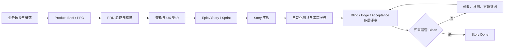
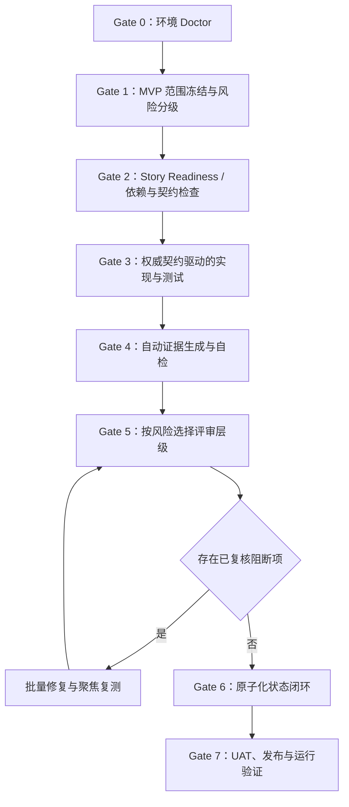

# 轻量化开放平台：Agent 工具与项目流程阶段性技术复盘

日期：2026-08-18  
范围：Epic 1–4 已完成，Epic 5 进行中；本文件不代表项目结项，也不改变 Sprint 状态。

## 1. 技术结论

从技术人员视角看，这套 Agent 工作流的最大优势是：能把模糊业务需求逐步转换为 PRD、架构、UX、Story、代码、测试和追踪证据，并通过多层评审发现真实的安全、契约、并发和隔离缺陷。

最大问题则是：**质量控制偏后置，状态和证据缺乏单一事实源，导致同一 Story 经历多轮“实现—报告通过—评审推翻—补测—再评审”循环。** 对安全平台而言，这种严格性有价值；但对三个月轻量 MVP，流程成本明显过高。

简要判断：

- 需求与架构产物：成熟，可支持后续开发。
- 代码和自动化测试：质量逐步提升，关键安全路径已有较强覆盖。
- Agent 流程效率：偏低，主要损耗来自过度交互、后置审查和文档状态同步。
- 当前产品状态：尚未达到生产发布完成；开放 API 安全入口接近完成，但三项真实查询 API、环境启用和首客端到端验收仍未完成。

## 2. 当前项目进展与客观数据

| 项目 | 当前结果 |
|---|---:|
| 已完成 Epic | 4 |
| 进行中 Epic | 1（Epic 5） |
| 已完成 Story | 7 |
| 待最终复审 Story | 1（5.1） |
| 已关闭评审发现 | 168 |
| 当前开发提交数（相对初始基线） | 16 |
| 变更规模 | 约 180 个文件、11,647 行新增、405 行删除 |
| 测试与追踪报告 | 16 份 |
| Story 5.1 后端完整测试 | 80 项通过 |

“168 条评审发现”包含代码缺陷、边界场景、测试证据缺口和文档追踪问题，并不等于 168 个独立生产缺陷。但它足以说明：大量问题在实现完成后才被发现，返工成本偏高。

## 3. 本项目实际采用的流程

### 已完成的主要能力

- 项目基线、前后端工程、数据库迁移、测试基础设施。
- 企业注册、人工审核状态、账号密码登录和 Redis 会话。
- 单应用创建、AppID/AppSecret 首次展示和受控重置。
- 三项接口权限申请、人工审批和状态展示。
- OpenAPI 文档、签名规范、跨语言示例与固定测试向量。
- 开放 API 安全入口的签名、重放防护、持续授权、租户范围绑定和限流基础能力。

### 尚未完成的主要能力

- Story 5.1 最终代码复审和状态闭环。
- 三项真实只读业务 API 与数据中台接入。
- 沙箱启用、生产环境人工准入和配置闭环。
- 首批客户端到端联调、部署、UAT、容量与运行手册验收。

## 4. Agent 工具做得好的地方

### 4.1 需求结构化能力强

Agent 将最初的业务描述补齐为可追踪的业务目标、角色、范围、成功指标、FR/NFR、领域约束和数据契约。PRD 经修订后达到较高的可衡量性和可追踪性，避免了直接进入编码造成更大返工。

### 4.2 多角色评审真正发现了深层缺陷

Blind Hunter、Edge Case Hunter 和 Acceptance Auditor 分别从实现缺陷、边界路径和验收证据检查代码，发现过以下高价值问题：

- AppSecret 进入标准输出、并发重置和幂等性缺失。
- 登录会话 Cookie 安全属性没有真正生效。
- 审核 SQL 的事务、双人复核和审计约束不足。
- OpenAPI `allOf` 与 `additionalProperties` 组合导致合法响应不合规。
- API 文档资源可能绕过登录保护。
- 签名规范与服务端实际路径不一致。
- Redis 异常结果可能导致安全路径错误放行。
- 不同接口权限的客户范围可能被错误合并。

这些问题仅靠普通 happy-path 开发测试很难全部发现。

### 4.3 追踪机制提升了交付可信度

AC → Task → Test/Evidence → Requirement Change Log 的链条虽然繁重，但有效阻止了“代码改了、需求和报告没改”的静默漂移。对鉴权、租户隔离、一次性密钥等高风险能力，这种约束是有价值的。

### 4.4 工程化基础较完整

项目已形成 Java/Spring Boot、React、MySQL、Redis、Flyway、Testcontainers、OpenAPI、ArchUnit 和前端测试组合，能够支持后续三个查询接口继续开发，不再是一次性原型。

## 5. Agent 工具的缺失与优先改进点

## P0：必须优先改进

### 5.1 缺少统一、原子化的项目状态源

现象：Story frontmatter、正文状态、Sprint 状态、artifact manifest、自动化报告和追踪矩阵都能表达状态，曾出现 `in-progress`、`review`、`done` 不一致，以及父任务已勾选但子任务未勾选。

影响：Agent 和人工无法快速判断真实进度；评审可能基于过期报告；“完成”容易变成文档声明而不是系统事实。

建议：

- 只保留一个机器可写的状态源，例如 `sprint-status.yaml` 或结构化 Story manifest。
- Story 文本和报告中的状态全部由状态源生成，不允许手工重复维护。
- 状态迁移采用事务式命令：测试通过、追踪完整、评审 Clean 后一次性更新所有派生产物。
- 增加 `agentic doctor --state`，发现状态冲突立即阻断。

### 5.2 缺少“证据驱动”的 PASS 生成机制

现象：多个 Story 的 automation/traceability 报告曾先标 PASS，后被评审发现实际没有覆盖会话过期、Redis 故障、Cookie 属性、响应式键盘、并发回滚等场景。测试总数也曾被用来替代 AC 场景覆盖。

影响：报告可信度下降；评审不得不重新证明每个结论，形成重复劳动。

建议：

- 每个 AC 必须绑定可执行测试 ID、命令、退出码和结果摘要，禁止仅写自然语言“已覆盖”。
- 报告由测试结果自动生成；测试未执行、跳过或无法定位时只能是 `UNKNOWN`/`PARTIAL`，不能是 PASS。
- 测试数量只作为统计，不作为验收证据。
- 增加报告一致性校验：报告计数、测试清单、Git diff 和 Story checkbox 必须匹配。

### 5.3 Story 开发前缺少强制 readiness/lint 门禁

现象：Story 1.3 要求“登录后的状态页”，但登录会话原本排在 Story 1.4；直到开发阶段才发现顺序矛盾。Story 5.1 初版也存在租户 scope、过滤器错误码、请求边界、限流语义和执行顺序未冻结的问题。

影响：问题越晚发现，修改 Story、架构、代码和测试的范围越大。

建议：在 Story 进入开发前自动检查：

- 依赖 Story 是否已经提供所需能力。
- AC、Task、Tests Required 是否一一映射。
- 状态机、错误码、并发语义、数据归属、限流和失败副作用是否封闭。
- 是否引用真实存在的契约、配置和代码能力。
- 是否存在跨 Story 偷带功能或顺序倒置。

未通过 readiness 的 Story 不允许进入 `in-progress`。

### 5.4 缺少环境预检和稳定依赖缓存策略

现象：前期缺 Java/Docker；Windows 沙箱不能直接复用用户 `.m2`；反复复制约 147MB Maven 缓存；Docker/Testcontainers 需要额外权限；未执行 `clean` 时旧测试资源造成假失败。

影响：大量时间耗在环境问题而非业务开发，并容易把环境故障误判为代码缺陷。

建议：

- 项目启动第一步执行 `doctor`：Java、Node、Docker、端口、磁盘、证书、Git、Maven 缓存权限。
- 明确 workspace 内统一 Maven/Node 缓存位置，禁止重复嵌套复制。
- 测试命令固定清理策略，检测 stale resource/class。
- 把需要 Docker、网络或外部目录权限的命令提前列为一次性授权项。
- 环境失败在报告中单独归类为 `BLOCKED_BY_ENVIRONMENT`，不混入功能失败。

## P1：显著提升效率

### 5.5 缺少风险分级的工作流配置

现象：轻量 MVP 的普通页面、文档和高风险鉴权能力使用了近似同等强度的需求、追踪和多轮审查流程。用户已经明确反馈进度过慢并要求批量、简化。

建议建立三档：

- Lean：普通 CRUD、静态页面、低风险文档；单轮实现与测试。
- Standard：业务流程、数据库状态迁移；验收评审 + 边界检查。
- Assured：密钥、鉴权、租户隔离、资金/隐私；完整三层评审和故障注入。

本项目只有登录、密钥、权限审核、网关鉴权和数据隔离需要 Assured；其他 MVP 能力不应默认使用最高强度。

### 5.6 测试设计过度依赖“实现镜像”

现象：Story 5.1 的集成测试辅助代码曾复刻服务端完整路径签名，而没有直接消费 Story 4.1 的权威固定向量，因此实现和测试可以一起错。另有 CSS 字符串检查被当作真实 200% reflow 证据。

建议：

- 契约测试必须从权威 OpenAPI/fixture 读取输入，禁止复制常量。
- 布局、键盘、浏览器历史等行为使用浏览器级测试，不用文本搜索代替。
- 优先验证语义边界与故障副作用，而不是继续增加重复 happy-path 数量。
- 每条安全 AC 至少包含正向、反向、边界、并发/重试和依赖失败五类中的适用项。

### 5.7 多 Agent 评审缺少去重和置信度治理

现象：三类评审发现了重要问题，但也出现重复、误读冻结语义和同一问题多轮改写。主 Agent 需要大量人工式分类。

建议：

- 汇总前按“同一根因、同一文件、同一 AC”自动聚类。
- 每条发现标注证据、严重度、置信度、是否与既定 AC 冲突。
- 先由主 Agent 做事实复核，再进入修复队列；未经复核的 finding 不直接修改代码。
- 复审只检查未闭环项和新 diff，避免每轮从头扫描造成噪声。

### 5.8 Requirement Change Log 语义不清且维护成本高

现象：RCL 多次因缺失、分类不合法、非追加式记录而阻断。初次实现也被迫套用“变更”分类，容易把正常实现和需求变更混在一起。

建议：

- 把 Initial Implementation Record 与 Requirement Change Log 分离。
- 初次实现只记录 AC、提交和测试；真正改变已批准行为时才写 RCL。
- RCL 由差异工具生成候选记录，人工只确认分类和批准。
- 合法分类使用枚举并由 schema 校验，避免自然语言自由填写。

### 5.9 Git 分支和工作区卫生不足

现象：分支名称长期停留在早期 Story，实际已连续开发多个 Epic；生成器会修改 tracked 文件；大量 `_agentic-out/.archive` 文件未跟踪并污染状态。

建议：

- 每个 Story 或 Epic 使用准确分支，或明确采用单一集成分支并重命名。
- 生成物必须声明为“提交产物”或“临时产物”，不可介于两者之间。
- Archive 使用固定保留策略并默认忽略，只保留关键里程碑快照。
- 每次 Story 开始和结束执行 worktree hygiene 检查，区分用户改动、Agent 改动和生成噪声。

## P2：体验与可维护性优化

### 5.10 交互步骤过碎

现象：流程中出现大量 `c`、`Y`、`0`、`A` 的单字符确认；标准、可逆、本地操作也频繁暂停。

建议：

- 增加 batch/autonomous 模式：用户一次确认一个阶段，而不是每个步骤确认。
- 只在范围变化、不可逆操作、安全敏感操作和真实业务选择时暂停。
- 每阶段给出默认选项和偏离条件，减少无信息量交互。

### 5.11 代码可读性没有成为独立质量门禁

现象：部分 Java/React 实现高度压缩，虽然测试通过，但维护成本和评审难度上升。

建议：统一 formatter、静态分析、复杂度和单行长度约束；把“可维护性”与“功能正确”分开验收。

### 5.12 产物数量多，但管理视图不足

现象：PRD、架构、UX、Story、automation、traceability、archive 都很完整，但技术负责人要跨多个目录才能判断风险和下一步。

建议：自动生成一页 Dashboard，只显示：当前 Story、阻断项、最近测试、未闭环 AC、工作区状态、下一 Gate 和发布剩余能力。

## 6. 建议的优化后流程

### 每个 Gate 的硬规则

1. 环境不健康，不开始开发。
2. 非 MVP 项不得混入当前 Story。
3. Story 依赖、AC 和测试不闭合，不进入开发。
4. 测试直接消费权威契约，避免实现与测试共同漂移。
5. 评审结论先去重和事实复核，再批量修复。
6. 测试、追踪、Story 和 Sprint 状态一次性更新。
7. Done 只表示可验收完成，不表示仅“代码写完”。

## 7. 针对当前项目的后续建议

按现有范围，建议依次完成：

1. 对 Story 5.1 进行最后一轮仅检查剩余 diff 的复审，Clean 后原子化标记 done。
2. 实现客户基础信息、订单列表、订单详情三个只读 API，优先保证字段契约、客户隔离、分页和数据中台失败语义。
3. 完成沙箱启用与生产人工准入，不扩展运营后台。
4. 选 1–2 家合作客户做端到端联调，再扩大到首批客户。
5. 执行 UAT、容量、安全、备份恢复和运行手册验收。
6. 最后统一整理分支、生成物、Archive 和 Git 提交并推送。

本阶段应继续坚持“不做生产写入、运营后台、Webhook、SDK、计费和多成员”等一期排除项，避免再次扩大范围。

## 8. 建议行动项

| 优先级 | 行动项 | Owner 建议 | 完成证据 |
|---|---|---|---|
| P0 | 建立唯一状态源与原子状态迁移 | Agent 工作流维护者 | 状态冲突检查为 0 |
| P0 | Automation/Traceability 改为测试结果生成 | QA / 工具维护者 | 无证据 AC 不可标 PASS |
| P0 | 增加 Story readiness lint | 技术负责人 / 产品 | 依赖、AC、测试和契约检查通过 |
| P0 | 增加环境 doctor 与统一缓存 | 开发 / 运维 | 新工作区一次检查即可启动 |
| P1 | 引入 Lean/Standard/Assured 风险档 | 产品 / 技术负责人 | 每个 Story 明确档位 |
| P1 | 评审 finding 自动聚类与置信度 | Agent 工具维护者 | 重复 finding 显著减少 |
| P1 | 分离初次实现记录与 RCL | 流程维护者 | RCL 只记录真实行为变更 |
| P1 | 清理分支、Archive、生成物策略 | 开发负责人 | `git status` 仅包含明确改动 |
| P2 | 增加批量自主执行模式 | Agent 工具维护者 | 标准阶段只需一次确认 |
| P2 | 增加项目交付 Dashboard | Agent 工具维护者 | 单页可见状态、风险和下一步 |

## 9. 最终评价

这套 Agent 工具不是“能力不够”，而是“质量能力强、流程控制尚未产品化”。它擅长完整性、追踪性和深度审查，但目前依赖大量 Markdown 同步、人工确认和后置复核，造成高返工率与较差的进度感知。

对本项目最有效的优化不是减少安全标准，而是：**把安全强度集中在真正高风险的 Story，把状态与证据自动化，把矛盾提前到开发前发现，并把多轮零散修复改为一次分级、去重后的批量修复。**
