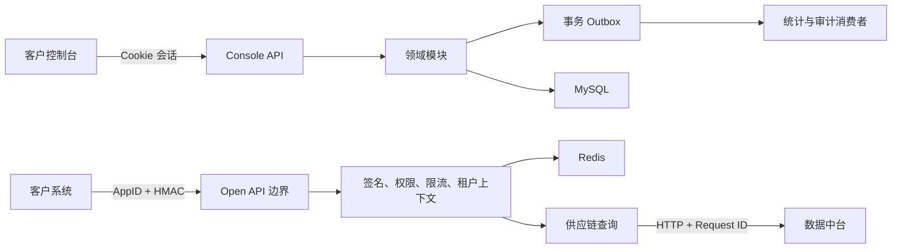

---
stepsCompleted:
  - 1
  - 2
  - 3
  - 4
  - 5
  - 6
  - 7
  - 8
inputDocuments:
  - "_agentic-out/planning/prd.md"
  - "_agentic-out/planning/product-brief.md"
  - "_agentic-out/planning/ux-design-specification.md"
  - "_agentic-out/planning/research/product-brief-distillate.md"
  - "_agentic-out/reviews/2026-08-11-prd-validation.md"
  - "_agentic-out/reviews/2026-08-12-ux-visual-quality.md"
workflowType: "architecture"
project_name: "demo"
user_name: "user"
date: "2026-08-12"
lastStep: 8
status: "complete"
completedAt: "2026-08-12"
---

# 架构决策文档——轻量化开放平台

_本文档通过逐步协作形成，记录会影响实现一致性的架构决策、边界与约束。_

## 项目上下文分析

### 首发实施剖面（2026-08-17 批准）

本节优先于后文面向完整一期的架构描述。首发仍使用 Java 21 + Spring Boot 模块化单体、React/Vite、MySQL、Redis 和 OpenAPI-first，但只实现注册/登录/状态、单一应用、简单权限申请、三个只读接口和人工生产开通。

- MySQL 首发保存企业、账号、单一应用、凭证元数据、三项权限、客户绑定和必要操作记录；统计聚合、问题工单、动态配额和内部审计查询表移至 1.x。
- Redis 首发仅承担控制台会话、登录/注册防滥用、nonce 和固定限流；不为延期能力预建权限缓存或统计处理。
- AppSecret 首发采用受控加密配置并仅首次展示；托管 KMS 信封加密、24 小时双密钥轮换和客户自助停用移至 1.x。生产凭证由技术负责人通过受控流程人工生成。
- 数据中台仍是唯一业务事实来源；三个查询端点使用同步 HTTP/REST 和统一超时/错误映射。首发订单列表采用 `page/pageSize`，不实现游标增量遍历。
- 首发不运行 Outbox、统计聚合器、问题工单、动态额度或独立审计查询模块；基础结构化日志与 Request ID 直接进入日志平台。
- 沙箱与生产继续使用不同地址、数据和凭证配置；页面不发起生产调试。
- 首发容量目标为最多 15 个应用、聚合 300 RPM、查询 P95 不超过 2 秒；3000 RPM、月度 99.9% 和完整容量隔离作为 1.x 目标。
- 安全底线不延期：HMAC-SHA256、±5 分钟时间戳、nonce、防重放、权限默认拒绝、客户范围可信绑定、零跨客户数据、脱敏和固定 60 RPM。

首发实施顺序为：保留 Story 1.1～1.3 → 状态查看/人工审核 → 单一应用 → 权限申请/人工审批 → 静态 OpenAPI 与示例 → 安全入口 → 三接口 → 沙箱与人工生产开通 → E2E/部署。完整架构能力仍作为 1.x 演进目标保留。

### 需求概览

**功能需求：** PRD 包含 65 条功能需求，形成账号与企业入驻、应用与凭证、接口权限与生产准入、文档与沙箱调试、三个供应链只读查询接口，以及鉴权限流、统计诊断、数据保护与审计六个能力域。系统同时存在客户 Web 控制台管理流量和外部客户系统直接调用的开放 API 流量；两者认证方式、性能目标和风险不同，但共享企业、应用、权限、环境和审计模型。

**非功能需求：** 42 条 NFR 的主要架构驱动因素包括生产 API 月度可用性不低于 99.9%、查询接口 P95 不超过 1 秒、平台原因失败率不超过 1%、RTO 不超过 4 小时、RPO 不超过 1 小时、至少 20 个应用、持续 2,400 RPM 与短时 3,000 RPM，以及 HMAC-SHA256 签名、防重放、默认拒绝、逐接口授权、零越权、密钥保护、境内处理、日志避敏、全链路 Request ID 和 WCAG 2.2 AA。

UX 不要求实时协作、离线能力或复杂动画。技术复杂度主要来自安全治理、跨系统数据一致性和可诊断性，而不是富交互前端。

### 规模与复杂度

- 主要技术领域：B2B API 后端 + 客户 Web 控制台
- 业务复杂度：中等
- 架构风险复杂度：中高
- 租户模型：企业客户隔离；企业、账号、应用和内部客户主数据形成绑定关系
- 外部集成：一个权威数据中台，以及企业微信/邮件人工支持流程
- 数据特征：订单与客户资料只读查询、分钟级新鲜度、最大 31 天查询窗口、单页最大 500 条
- 用户规模：首批 8～12 家客户、8～15 个应用，但底座需支持后续扩展
- 估计逻辑组件：约 8 个，不代表必须拆成 8 个独立服务

逻辑组件包括客户控制台前端、控制台管理 API、开放 API 接入与治理边界、身份/企业/应用管理、凭证与防重放、权限与生产准入、供应链查询适配，以及统计/日志/审计。当前规模不足以天然要求微服务，组件先形成清晰边界，部署形态在后续决策中确定。

### 技术约束与依赖

- 项目为 Greenfield，没有现有代码库或技术栈约束。
- 数据中台是客户资料与订单业务事实的唯一权威来源；开放平台只持有配置、绑定、权限、统计、审计和必要技术缓存。
- 订单列表支持按更新时间增量查询、稳定排序和游标分页。
- 沙箱与生产保持契约一致，但地址、凭证、权限、数据、限流和日志标识隔离。
- 沙箱使用模拟数据，不复制生产个人信息或真实订单。
- 一期受控数据库审核必须执行合法状态机、角色边界、双人复核和审计；未来运营后台复用同一领域能力。
- 一期不包含运营后台、生产写入、Webhook、计费、多成员、API 多版本和明细日志导出。
- UX 采用 shadcn/ui 组件模型、桌面优先布局和明确的移动端应急能力边界。
- 尚无云平台、编程语言、数据库、中间件或部署模式约束。
- 架构阶段需固化 RTO/RPO 验证边界及签名请求 ±5 分钟有效窗口。

### 识别出的横切关注点

- **租户与数据隔离：** 调用凭证必须解析到企业、应用、环境和内部客户主数据范围；客户端客户标识不能单独构成授权依据。
- **身份与凭证安全：** 账号密码、AppSecret、签名、nonce、防暴力破解和密钥轮换分别设计生命周期、存储、审计与失效策略。
- **状态机与审核：** 入驻、权限、应用和生产准入采用封闭状态集；数据库审核不能绕过领域规则。
- **环境隔离：** 沙箱与生产共享契约但隔离地址、凭证、权限、数据、限流、日志和准入条件。
- **可靠性与下游保护：** 对数据中台定义超时、并发控制、容量保护、错误映射和降级边界，禁止用陈旧或不完整数据伪装成功。
- **契约一致性：** OpenAPI、示例、在线调试、沙箱和生产 API 来自同一契约基线。
- **可观测与诊断：** Request ID 贯穿入口、业务处理与数据中台调用，统一错误分类和指标口径。
- **隐私与审计：** 手机号、地址、凭证和签名执行一致脱敏；审核、重置、停用、授权和生产启用形成完整审计事件。
- **演进边界：** 身份、权限、契约、租户和审计模型允许二期运营后台及更多查询接口复用，临时数据库审核不是永久架构入口。

## 起步模板评估

### 主要技术领域

本项目是 API 后端为核心、配套客户 Web 控制台的全栈项目。后端安全治理、事务状态机、审计、指标与数据中台集成比前端服务端渲染更关键，因此采用两个官方起步器组成单仓库，而不使用一体化全栈模板。

```text
repository/
├─ apps/
│  ├─ api/       # Spring Boot 模块化单体
│  └─ web/       # React + Vite 客户控制台
├─ contracts/    # OpenAPI 契约与示例
├─ deploy/       # 容器和环境配置
└─ docs/         # 架构决策与运行手册
```

### 评估过的起步方案

| 方案 | 优点 | 风险 | 结论 |
|---|---|---|---|
| Spring Boot + React/Vite | 安全、事务、审计、监控生态成熟；适合长期企业维护 | 初始代码量较 Python 多 | 采用 |
| FastAPI + React/Vite | 开发轻便，类型模型和 OpenAPI 支持直接 | 框架仍为 0.x；复杂安全治理需要更多自行组合 | 备选 |
| Next.js 全栈 + Java API | 前端路由和服务端能力完整 | 不需要 SSR，引入第二个服务端职责边界 | 不采用 |
| 微服务模板 | 独立伸缩和团队自治 | 首期规模过小，增加部署、事务和诊断成本 | 不采用 |

### 选择的起步方案

**后端：** Java 21 + Spring Boot 4.1 + Maven，采用 Spring Web、Security、Validation、Data JPA、MySQL Driver、Actuator、Flyway 与 Testcontainers。初始化时通过 Spring Initializr 实时元数据确认依赖标识及最新兼容补丁版本。

```bash
curl "https://start.spring.io/starter.zip?type=maven-project&language=java&bootVersion=4.1.0&javaVersion=21&groupId=com.company.openplatform&artifactId=api&name=api&packageName=com.company.openplatform&dependencies=web,security,validation,data-jpa,mysql,actuator,flyway,testcontainers" -o api.zip
```

**前端：** React + TypeScript + Vite + shadcn/ui，使用 pnpm。

```bash
pnpm dlx shadcn@latest init -t vite
```

### 起步方案提供的架构决策

**语言与运行时：** 后端采用 Java 21，前端采用 TypeScript；前后端通过 OpenAPI 契约交互，不共享运行时代码。

**样式：** 使用 Tailwind CSS 语义令牌和 shadcn/ui 项目内组件源码；青灰主题与 UX 规格一致，不引入第二套组件库。

**构建：** 后端使用 Maven Wrapper，前端使用 pnpm 与 Vite；两个应用独立构建、测试和发布，根目录仅负责工作区编排。

**测试：** 后端采用 Spring Boot Test、JUnit 和 Testcontainers；MySQL 集成行为使用真实 MySQL 容器验证，不以 H2 替代。

**代码组织：** 后端采用模块化单体，按 `identity`、`application`、`permission`、`credential`、`admission`、`supplychain`、`observability` 和 `shared` 业务能力组织。模块间通过明确接口和领域事件协作，一期部署为单个后端应用。

**开发体验：** Actuator 提供健康与指标基础，Flyway 管理数据库变更，OpenAPI 作为文档、沙箱和生产契约基线，本地容器环境至少包含 MySQL。项目初始化作为第一条实施 Story。

## 核心架构决策

### 决策优先级分析

**阻断实施的关键决策：** Java 21 + Spring Boot 4.1 模块化单体；React + TypeScript + Vite + shadcn/ui；MySQL LTS；Redis；数据中台 HTTP/REST 防腐层；控制台服务端 Cookie 会话；开放 API AppID + HMAC-SHA256；OpenAPI 设计优先；托管容器、MySQL、Redis、密钥管理和日志监控。

**重要决策：** 订单与客户业务事实不落本地副本；沙箱与生产契约一致、运行隔离；React Router 数据路由 + TanStack Query；控制台与管理 API 同域；Request ID、结构化日志、Micrometer 和 OpenTelemetry；API 与统计聚合可使用同一镜像的不同运行模式；MySQL 集成测试使用 Testcontainers。

**延后决策：** 具体云厂商、Kubernetes、微服务拆分、读写分离、分库分表、业务响应缓存、多版本 API 管理、客户自助告警和日志导出。

### 数据架构

- MySQL 保存企业、账号、应用、凭证元数据、权限、审核、生产准入、审计和统计聚合。
- 使用 Spring Data JPA；复杂统计查询可使用显式 SQL，但不得绕过租户范围。
- Flyway 是唯一数据库结构变更入口。
- 数据中台通过独立 HTTP/REST 适配模块访问，响应先转换为平台领域模型。
- 客户资料和订单事实不落本地副本，不直接读取数据中台数据库。
- 默认不缓存业务响应；下游失败时不返回陈旧数据。
- Redis 保存控制台会话、nonce、登录失败计数、限流桶和短期权限缓存。
- Redis 各用途采用独立键前缀、TTL、指标和失败策略。
- 匿名注册使用 Redis 原子计数形成跨实例共享的 `registration:abuse` 与 `registration:business` 两类额度。所有匿名注册 POST 消耗防滥用额度；只有通过 CSRF、媒体类型、请求体和字段校验并进入注册用例的请求消耗正常业务额度，因此无效 CSRF 与超大请求不得挤占正常注册额度。
- 客户 IP 只在 TCP 对端地址属于配置的可信代理时从转发头解析；非可信来源携带的转发头必须忽略。Redis 无法完成匿名注册关键限流判断时失败关闭并返回统一、可重试的 `503`，不得退化为进程内或无限流模式。
- 调用日志异步聚合到 MySQL 小时/日统计表，不阻塞查询主链路。
- 数据库使用托管 MySQL LTS 系列，实施时选择云平台支持的当前安全补丁版。

### 认证与安全

**控制台认证：** 登录名或手机号加密码；账号有效且密码正确时可建立 Spring Security 服务端会话，入驻状态不作为认证成功与否的判据；`HttpOnly + Secure + SameSite` Cookie；Redis 统一存储会话；变更请求启用 CSRF；一期不使用 JWT。

**开放 API：** HMAC-SHA256 签名覆盖 HTTP 方法、规范化路径、排序后的查询参数、请求体 SHA-256 摘要、时间戳和 nonce。请求窗口固定为 ±5 分钟；nonce 在窗口内唯一，使用 Redis 原子写入和 TTL。密钥轮换窗口为 24 小时，AppSecret 仅创建或重置时展示一次。

**授权与隔离：** 默认拒绝；控制台认证与入驻授权分离，`PENDING_REVIEW`、`REJECTED` 会话仅可访问本人入驻状态、资料修正、退出和必要支持能力，`APPROVED` 会话才可进入平台总览；每次请求按服务端最新入驻状态重新授权，不依赖登录时缓存结论，前端路由守卫不是安全边界。开放 API 每次请求验证环境、应用状态、生产准入和逐接口权限；企业及数据范围从可信绑定关系解析，不信任请求中的客户标识；内部人工审核不通过客户控制台暴露。

**加密与审计：** 所有链路使用 HTTPS；密码使用自适应单向哈希；AppSecret 采用信封加密，主密钥由托管密钥管理服务持有；敏感操作写入仅追加审计事件；日志禁止记录密钥、完整签名、完整手机号、详细地址和业务响应体。

### API 与通信模式

```text
/console/api/v1/**  客户控制台管理 API
/openapi/v1/**      生产开放 API
/sandbox/v1/**      沙箱开放 API
/internal/**        健康与受控内部能力
```

- API 使用 REST + JSON，`contracts/openapi/` 是唯一契约源。
- 后端接口骨架、前端客户端、文档、沙箱表单、模拟数据和契约测试从契约派生。
- 沙箱与生产共享模型和错误码，隔离数据源、安全配置和凭证。
- 统一错误包含 `code`、`message`、`requestId`、`details` 和 `retryable`。
- 协议失败使用正确 HTTP 状态，不以 HTTP 200 包装失败；所有响应携带 Request ID。
- 数据中台采用同步 HTTP/REST，设置连接、读取和总耗时预算。
- 仅对幂等查询的瞬时网络故障有限重试；使用熔断、并发隔离和总容量保护。
- 4xx、业务错误和数据时效异常不重试；传递 Request ID，不传递外部密钥或签名。
- 默认每应用、每环境 60 RPM，突发 20；Redis 原子限流；超限返回 `429` 与 `Retry-After`。
- 匿名注册的防滥用与正常业务阈值独立配置并使用不同键空间；超大请求稳定返回 `413`，不支持的媒体类型或字符集返回 `415`，任一额度超限返回 `429` 与 `Retry-After`。
- 客户级限流覆盖必须审批并审计；平台总容量保护优先限制异常应用。

### 前端架构

- React + TypeScript + Vite SPA，不采用 SSR。
- React Router 数据路由管理导航、懒加载和路由错误边界。
- TanStack Query 管理服务端状态、刷新、重试和 mutation 后失效。
- React Hook Form 管理未提交表单；筛选、分页和选中接口保存在 URL。
- 一期不引入 Redux 或 Zustand。
- OpenAPI 生成 TypeScript 客户端和类型。
- 同域反向代理访问控制台 API，减少 Cookie、CORS 和 CSRF 边界。
- 待审核和驳回账号使用专用路由，服务端始终重新验证权限。
- AppSecret 只存在于首次展示组件内存，离开页面后清除。
- 使用严格 CSP；前端监控不得采集敏感数据或业务响应体。

### 基础设施与部署

- 使用托管容器平台、托管 MySQL、托管 Redis、日志监控和密钥管理服务。
- 保持云厂商中立，只依赖标准容器、SQL、Redis 协议和 OpenTelemetry。
- API 服务无状态并支持水平扩展。
- 沙箱与生产使用独立域名、凭证、数据库边界、Redis 命名空间和密钥。
- 同一代码库和镜像可按 API 或统计聚合模式运行。
- CI/CD 覆盖构建、测试、契约检查、安全扫描、Flyway 校验、镜像构建、部署后烟雾测试和回滚。
- 后端使用 Actuator + Micrometer，全链路使用 OpenTelemetry，日志采用结构化 JSON。
- 普通调用日志和审计日志分开存储、授权和留存。
- 暂不引入 Kubernetes、分库分表或微服务。

### 决策影响分析

**实施顺序：**

1. 初始化单仓库、前后端应用及本地 MySQL/Redis。
2. 固化 OpenAPI、通用错误模型和 Request ID。
3. 建立 Flyway 基线及企业、账号、应用、权限状态机。
4. 实现控制台会话、密码安全、按最新入驻状态授权和 CSRF；随后实现仅基于认证主体的入驻状态查询与修正。
5. 实现 AppSecret、签名、防重放和限流。
6. 建立数据中台 HTTP 防腐层及三个查询端点。
7. 建立沙箱模拟器和生产准入边界。
8. 实现调用事件、统计聚合、日志和审计。
9. 完成容器部署、备份恢复、容量与安全门禁。
10. 接入首批客户试点。

**跨组件依赖：** OpenAPI 先于客户端、沙箱和后端端点；企业—应用—客户主数据绑定先于生产查询；Redis 可用性影响会话、防重放和限流，必须采用失败关闭策略；数据中台 SLA 决定开放 API 超时预算和可用性上限；审计模型必须先于临时数据库审核脚本。

## 实施模式与一致性规则

### 已定义的模式类别

关键冲突点覆盖数据库/API/代码命名、模块与测试位置、响应和数据格式、事件与前端状态、事务、错误重试、加载反馈以及结构化日志。以下规则是所有开发任务的共同约束。

### 命名模式

**数据库：** 表与列使用小写 `snake_case`；表名使用复数；主键统一为 `id`，公开业务标识使用独立字段；外键为 `<entity>_id`；时间字段为 `created_at`、`updated_at`；索引、唯一约束和外键分别使用 `idx_`、`uk_`、`fk_` 前缀。避免保留字及 `type`、`data` 等模糊名称。

**API：** 路径使用小写复数名词，路径参数和 JSON 使用 `camelCase`；Header 使用短横线格式；业务错误码使用 `UPPER_SNAKE_CASE`；资源命令优先建模为子资源，例如 `/applications/{applicationId}/secret-rotations`。

**Java：** 类型 `PascalCase`，方法和变量 `camelCase`，常量 `UPPER_SNAKE_CASE`。用例以 `UseCase` 结尾；端口如 `DataPlatformClient`，实现如 `HttpDataPlatformClient`；API DTO 使用 `Request`/`Response`。禁止无语义的 `CommonService`、`BaseManager` 和 `Utils`。

**TypeScript：** React 组件及文件使用 `PascalCase.tsx`；普通模块、Hook 和测试文件使用 `kebab-case`；Hook 导出为 `useXxx`；OpenAPI 生成代码位于 `src/generated/api` 且禁止手工编辑。

### 结构模式

后端模块统一采用：

```text
<module>/
├─ api/             # HTTP DTO、Controller、映射
├─ application/     # 用例与事务边界
├─ domain/          # 聚合、值对象、规则、端口
└─ infrastructure/  # JPA、Redis、HTTP 客户端实现
```

模块只能通过公开应用接口交互，不直接引用其他模块的 Repository 或 JPA 实体。`shared` 只保存真正跨模块且稳定的技术能力。审核数据库脚本调用受控过程或命令入口，不任意更新业务表。

前端统一采用：

```text
src/
├─ app/               # Router、Provider、全局错误边界
├─ features/          # 按业务能力组织页面和逻辑
├─ components/ui/     # shadcn/ui 基础组件
├─ components/domain/ # 业务组合组件
├─ generated/api/     # OpenAPI 生成代码
├─ lib/               # 稳定基础能力
└─ styles/            # 语义令牌与全局样式
```

页面、查询、mutation 和业务组件优先放入对应 `features`；只有在两个以上业务域稳定复用时才提升到共享目录。前端测试与模块相邻，系统级测试位于 `tests/e2e`；后端单元测试镜像生产包结构，集成测试使用 `*IntegrationTest`。

### 格式模式

单资源与列表直接返回契约定义模型，不增加无意义的通用 `{data}` 包装。游标分页统一为：

```json
{
  "items": [],
  "nextCursor": "opaque-value",
  "hasMore": true,
  "requestId": "req_xxx"
}
```

错误统一为：

```json
{
  "code": "PERMISSION_DENIED",
  "message": "应用未获得该接口权限",
  "requestId": "req_xxx",
  "details": [],
  "retryable": false
}
```

业务代码不得自行拼装错误 JSON。统一异常映射器负责 HTTP 状态、业务码、日志级别和可重试性。日期时间使用带时区 ISO 8601，内部与存储使用 UTC、界面使用中国标准时间；金额为十进制字符串；枚举使用大写稳定代码；布尔值使用 JSON `true/false`；`null` 与未提供严格按 OpenAPI 区分；游标不可由客户端解析。

### 通信模式

领域事件使用过去式，如 `ApplicationCreated`。事件至少包含 `eventId`、`eventType`、`occurredAt`、`aggregateId`、`enterpriseId`、`requestId`、`actor` 和版本。进程内事件用于模块解耦；影响统计或审计持久性的事件使用事务 Outbox；消费者必须幂等，不用事件替代明确的同步领域调用。

前端服务端数据只由 TanStack Query 管理；可分享状态写入 URL；表单草稿由 React Hook Form 管理；敏感值禁止进入 Query Cache、URL、localStorage 或持久化状态；mutation 成功后按资源键精准失效。

### 过程模式

**事务：** 边界位于应用用例层；HTTP、Redis 和数据中台调用不在长数据库事务中等待；状态转换使用乐观锁或条件更新；审计与业务状态在同一事务提交；外部调用通过幂等、Outbox 和补偿实现一致性。

**错误与重试：** 仅适配器判断技术错误是否可重试；Controller 不实现重试；认证、权限、参数、业务拒绝和数据时效错误禁止重试；数据中台重试受总耗时预算约束；Redis 对会话、防重放和限流不可用时失败关闭，统计缓存可降级但必须记录指标。

**加载与反馈：** 首次加载使用结构匹配的 Skeleton；局部刷新保留已有内容；mutation 使用局部提交状态；API 调试区分请求中、成功、协议失败、网络失败和超时；危险操作完成后显示持久结果。

**日志：** 统一字段包括 `timestamp`、`level`、`service`、`environment`、`requestId`、`traceId`、`enterpriseId`、`applicationId`、`endpoint`、`resultType` 和 `durationMs`。不得记录签名原文或未经处理的客户输入；客户错误使用 INFO/WARN，平台故障使用 ERROR；同一故障不在多层重复打印堆栈。

### 执行约束

所有开发任务必须先修改或引用 OpenAPI，再修改开放接口；通过 Flyway 修改数据库；从安全上下文取得企业范围；使用统一错误、审计、日志和 Request ID 能力；保持模块依赖方向；为新增状态提供成功、失败、权限拒绝和并发边界测试；使用 MySQL/Redis Testcontainers 验证依赖行为。CI 检查契约、迁移、模块边界、格式与敏感日志。

### 示例与反模式

**正确示例：** `POST /applications/{applicationId}/secret-rotations`；`PermissionApprovalUseCase.approve(command)`；`HttpDataPlatformClient.findOrders(query, customerScope)`；`uk_applications_app_id`；`PermissionApproved` 通过 Outbox 驱动异步扩展。

**禁止：** Controller 跨模块访问 Repository；信任请求中的 `customerId`；记录 AppSecret、签名或响应体；用 HTTP 200 表达鉴权失败；在数据库事务内等待数据中台；下游故障时返回 Redis 中的陈旧订单；修改 OpenAPI 生成目录；在 `localStorage` 保存令牌或密钥。

## 项目结构与边界

### 完整项目目录结构

```text
open-platform/
├─ README.md
├─ CONTRIBUTING.md
├─ pom.xml
├─ pnpm-workspace.yaml
├─ package.json
├─ .editorconfig
├─ .gitignore
├─ .env.example
├─ apps/
│  ├─ api/
│  │  ├─ pom.xml
│  │  ├─ Dockerfile
│  │  └─ src/
│  │     ├─ main/
│  │     │  ├─ java/com/company/openplatform/
│  │     │  │  ├─ OpenPlatformApplication.java
│  │     │  │  ├─ identity/{api,application,domain,infrastructure}/
│  │     │  │  ├─ application/{api,application,domain,infrastructure}/
│  │     │  │  ├─ credential/{api,application,domain,infrastructure}/
│  │     │  │  ├─ permission/{api,application,domain,infrastructure}/
│  │     │  │  ├─ admission/{api,application,domain,infrastructure}/
│  │     │  │  ├─ supplychain/{api,application,domain,infrastructure}/
│  │     │  │  ├─ sandbox/{api,application,domain,infrastructure}/
│  │     │  │  ├─ statistics/{api,application,domain,infrastructure}/
│  │     │  │  ├─ audit/{application,domain,infrastructure}/
│  │     │  │  └─ shared/{api,security,observability,persistence,time}/
│  │     │  └─ resources/
│  │     │     ├─ application.yml
│  │     │     ├─ application-{local,sandbox,production}.yml
│  │     │     ├─ db/migration/
│  │     │     └─ logback-spring.xml
│  │     └─ test/
│  │        ├─ java/com/company/openplatform/{architecture,identity,application,credential,permission,admission,supplychain,sandbox,statistics}/
│  │        └─ resources/{application-test.yml,fixtures/}
│  └─ web/
│     ├─ package.json
│     ├─ vite.config.ts
│     ├─ tsconfig.json
│     ├─ components.json
│     ├─ eslint.config.js
│     ├─ Dockerfile
│     ├─ public/
│     └─ src/
│        ├─ main.tsx
│        ├─ app/{router.tsx,providers.tsx,route-guards.ts,error-boundary.tsx}
│        ├─ features/{auth,onboarding,dashboard,applications,credentials,permissions,admission,api-docs,sandbox-debugger,statistics}/
│        ├─ components/ui/
│        ├─ components/domain/
│        │  ├─ OnboardingTracker.tsx
│        │  ├─ ReviewStatusPanel.tsx
│        │  ├─ OneTimeSecretReveal.tsx
│        │  ├─ SecretRotationPanel.tsx
│        │  ├─ PermissionMatrix.tsx
│        │  ├─ SandboxRequestRunner.tsx
│        │  ├─ ResponseInspector.tsx
│        │  └─ DangerActionDialog.tsx
│        ├─ generated/api/
│        ├─ lib/{query-client.ts,api-error.ts,date-time.ts,request-id.ts}
│        └─ styles/{globals.css,tokens.css}
├─ contracts/
│  ├─ openapi/
│  │  ├─ console-v1.yaml
│  │  ├─ openapi-v1.yaml
│  │  ├─ sandbox-v1.yaml
│  │  └─ components/{schemas.yaml,errors.yaml,security.yaml}
│  ├─ examples/{customers,orders,errors}/
│  └─ generated/
├─ tools/{controlled-review,contract-generation,sandbox-fixtures,security-checks}/
├─ tests/
│  ├─ e2e/{onboarding,application-management,permission-application,sandbox-debugging,secret-rotation}/
│  ├─ contract/
│  ├─ performance/
│  └─ security/{signature,replay,tenant-isolation}/
├─ deploy/
│  ├─ compose/compose.local.yml
│  ├─ container/
│  ├─ environments/{sandbox,production}/
│  └─ observability/{dashboards,alerts,otel}/
├─ docs/
│  ├─ adr/
│  ├─ runbooks/{data-platform-outage.md,redis-outage.md,credential-compromise.md,rollback.md}
│  └─ security/
└─ .github/workflows/{api-ci.yml,web-ci.yml,contract-ci.yml,security-ci.yml,release.yml}
```

### 架构边界

**API：** `identity` 负责账号、密码、会话和登录锁定；`application` 负责应用生命周期和 AppID；`credential` 负责 AppSecret 创建、加密、轮换和失效；`permission` 负责逐接口授权；`admission` 负责客户主数据绑定和生产准入；`supplychain` 负责生产查询及数据中台适配；`sandbox` 负责模拟数据；`statistics` 负责调用聚合；`audit` 负责不可变审计；`shared` 不包含业务状态或用例。

**前端组件：** Feature 只通过生成客户端访问后端；`components/ui` 不含业务规则；`components/domain` 可组合状态和交互但不直接发请求；Query 和 mutation 留在 Feature；路由守卫不是安全边界。

**服务：** 一期为单部署单元，但模块依赖受架构测试约束；`supplychain` 只通过 `DataPlatformClient` 访问数据中台；统计和审计通过事件或 Outbox 消费；各模块通过共享技术端口使用 Redis，不自行发明键规则。

**数据：** 模块只访问其拥有的表；跨模块读取通过应用接口或只读投影；审计表仅追加；业务订单和客户事实不写入平台 MySQL；沙箱禁止引用生产标识；企业范围由安全上下文注入 Repository 与数据中台端口。

### 需求到结构映射

| 需求能力 | 后端位置 | 前端位置 | 测试位置 |
|---|---|---|---|
| 注册、登录、入驻 | `identity/` | `features/auth`、`onboarding` | `tests/e2e/onboarding` |
| 应用管理 | `application/` | `features/applications` | `application-management` |
| AppSecret 与轮换 | `credential/` | `features/credentials` | `secret-rotation`、`security` |
| 接口权限 | `permission/` | `features/permissions` | `permission-application` |
| 生产验收 | `admission/` | `features/admission` | 后端集成与安全测试 |
| 三个查询接口 | `supplychain/` | API 文档与统计入口 | `contract`、`performance` |
| 沙箱调试 | `sandbox/` | `features/sandbox-debugger` | `sandbox-debugging` |
| API 文档 | `contracts/openapi` | `features/api-docs` | `contract` |
| 调用统计 | `statistics/` | `features/statistics` | 统计集成测试 |
| 审计与人工审核 | `audit/`、`tools/controlled-review` | 一期无运营页面 | 审计与状态机测试 |
| 签名、限流、隔离 | `shared/security` 与业务边界 | 错误诊断展示 | `tests/security` |

### 集成点



浏览器与管理 API 同域；开放 API 和沙箱使用不同域名及凭证；数据中台仅由供应链适配器访问；MySQL 与 Outbox 保证状态和事件原子提交；Redis 不作为业务事实来源；Request ID 和 Trace Context 跨同步边界传播。

### 文件组织模式

环境配置只保存非敏感默认值，密钥由部署平台注入；`.env.example` 只列变量名和安全示例；Flyway 脚本采用递增版本；OpenAPI 拆分文件在 CI 打包为单一有效契约；生成代码统一进入 `generated`；架构决策进入 `docs/adr`，运行手册进入 `docs/runbooks`；业务模拟数据位于契约示例或沙箱 fixture，不进入前端静态资源。

### 开发工作流集成

**本地：** Docker Compose 启动 MySQL、Redis 和数据中台模拟服务；前后端各自热更新；本地反向代理复现同域路径；禁止使用真实客户资料。

**构建：** OpenAPI 校验和生成先于编译；Maven 构建后端镜像，pnpm/Vite 构建前端；同一提交通过模块边界、契约、迁移和敏感信息检查。

**部署：** 前端与 API 可独立发布；后端镜像通过运行模式启动 API 或聚合任务；Flyway 作为受控发布步骤执行；沙箱与生产从相同制品提升，仅配置与密钥不同；发布后验证健康、登录、签名、三个查询接口、隔离和日志关联。

## 架构验证结果

### 一致性验证

**决策兼容性：通过。** Java 21、Spring Boot 4.1、MySQL LTS、Redis、React/Vite 和托管容器之间不存在结构性冲突。模块化单体匹配当前规模；OpenAPI 设计优先统一前端、后端、文档、沙箱和契约测试；Redis 服务端会话与同域 Cookie 一致；MySQL Outbox 支持异步统计而无需消息队列；数据中台同步 REST 与只读 API 模型一致。

**模式一致性：通过。** 命名覆盖数据库、API、Java、TypeScript、事件和测试；错误、时间、金额、枚举、分页和 Request ID 格式统一；事务、重试、Redis 失败策略和日志等级无冲突；前后端状态职责明确；安全上下文贯穿 Repository 和数据中台端口。

**结构对齐：通过。** 65 条功能需求均映射至模块、Feature、契约或测试目录；42 条非功能需求具有安全、可靠性、性能、观测、部署或测试落点；临时审核隔离于受控工具；沙箱与生产共享契约并隔离运行边界。

### 需求覆盖验证

| 能力域 | 架构支持 | 结果 |
|---|---|---|
| 账号与入驻 | Identity、Redis Session、审核状态机 | 完整 |
| 应用与凭证 | Application、Credential、KMS、审计 | 完整 |
| 权限与准入 | Permission、Admission、默认拒绝 | 完整 |
| API 文档与调试 | OpenAPI、生成客户端、Sandbox | 完整 |
| 三个查询接口 | Supplychain、防腐层、稳定分页 | 完整 |
| 鉴权、限流与隔离 | HMAC、nonce、Redis、Tenant Context | 完整 |
| 统计与诊断 | 调用事件、聚合表、Request ID | 完整 |
| 隐私与合规 | 境内部署、加密、脱敏、审计 | 完整 |
| UX 与无障碍 | React/shadcn、响应式与测试边界 | 完整 |

### 非功能需求覆盖

- 性能：无状态 API、连接池、严格超时、有限重试、并发隔离和性能测试。
- 可用性：托管服务、健康检查、水平扩展、备份恢复和运行手册。
- 安全：Spring Security、HMAC、防重放、最小权限、密钥管理和失败关闭。
- 隔离：企业安全上下文、绑定范围、安全测试和沙箱/生产分离。
- 可靠性：Outbox、幂等消费者、条件更新和禁止陈旧数据降级。
- 可观测性：Micrometer、OpenTelemetry、结构化日志、Request ID 和错误分类。
- 兼容性：OpenAPI 基线、破坏性变更检查和同制品环境提升。
- 可访问性：WCAG 2.2 AA、键盘和读屏测试入口。

### 实施就绪验证

**决策完整性：高。** 阻断实施的技术、数据、安全、API、前端和部署决策均已确定。

**结构完整性：高。** 仓库、应用、模块、契约、工具、测试、部署、运行手册和 CI 均有具体位置。

**模式完整性：高。** 已覆盖命名、依赖方向、契约源、错误格式、事务边界、重试、状态、日志和敏感数据等主要冲突点。

### 缺口分析

**关键缺口：0。** 无阻止进入 Epic/Story 拆分的架构缺口。

**重要但不阻断：** 实施前确认数据中台超时、错误码和新鲜度契约；选择托管 MySQL、Redis、KMS 与日志产品；固化 RTO/RPO 演练起止和证据；定义审计与调用日志的产品及权限；定义 Redis 不可用时的客户提示。这些进入相关 Story 验收标准，不改变架构。

**可延后：** 运营审核后台、客户告警与日志导出、消息队列、API 多版本治理、业务缓存、微服务和 Kubernetes。

### 架构完整性清单

- [x] 项目上下文、规模与约束已分析
- [x] 技术栈和版本路线已确定
- [x] 数据、认证、安全和 API 决策已完成
- [x] 前端、部署和可观测性决策已完成
- [x] 命名、结构、格式、通信和过程模式已定义
- [x] 完整项目树与模块边界已定义
- [x] 需求到结构映射已完成
- [x] 外部集成与数据流已定义
- [x] 无关键缺口

### 架构就绪评估

**总体状态：READY FOR IMPLEMENTATION**  
**置信度：高**

主要优势是复杂度与一期规模匹配、安全与租户隔离前置、OpenAPI 统一契约、临时审核与未来后台共享状态机、数据中台防腐隔离，以及足以约束多任务协作的目录和实施规则。

### 实施交接

开发任务必须遵循本文档的决策、模式和边界。第一实施优先级是初始化单仓库及官方起步项目，建立契约校验、本地 MySQL/Redis 和最小 CI 基线，不从业务页面或查询接口直接开工。
